<!-- <script type="text/javascript" 
  src="http://cdn.mathjax.org/mathjax/latest/MathJax.js?config=TeX-AMS-MML_HTMLorMML">
</script>
<script type="text/x-mathjax-config">
  MathJax.Hub.Config({ tex2jax: {inlineMath: [['$', '$']]}, messageStyle: "none" });
</script> -->

# ELEC70122 Homework 1 — Beginner-Friendly Study Guide

> **Line-by-line walkthrough** of every cell in `ELEC70122_HW1_AI.ipynb`.
> Written for someone who is new to statistics and machine learning.
> All math is in LaTeX: inline with `$...$`, display with `$$...$$`.

---

## Table of Contents

1. [Introduction & Setup (Cells 0–4)](#1-introduction--setup-cells-04)
2. [Part I: Maximum Likelihood Estimation (Cells 5–18)](#2-part-i-maximum-likelihood-estimation-cells-518)
3. [Part II: Bayesian Polynomial Regression (Cells 19–31)](#3-part-ii-bayesian-polynomial-regression-cells-1931)
4. [Part III: Calibration & Posterior Predictive Checks (Cells 32–47)](#4-part-iii-calibration--posterior-predictive-checks-cells-3247)
5. [Part IV: Conformal Prediction (Cells 48–54)](#5-part-iv-conformal-prediction-cells-4854)

---

## 1. Introduction & Setup (Cells 0–4)

### Cell 0 — Homework Header (Markdown)

This cell simply states the homework title, course name (ELEC70122: ML for Safety Critical Decision-Making), instructor, and due date. Nothing technical here — it sets the stage.

### Cell 1 — Student Name (Markdown)

A placeholder for you to type your name. Standard homework admin.

### Cell 2 — Submission Instructions (Markdown)

Key points for a beginner:

- You write code **and** explanations together in this notebook.
- Before submitting, do "Restart and Run All" — this re-runs every cell from scratch to make sure nothing is broken.
- You can use any Python library that comes with the standard Anaconda distribution.

### Cell 3 — Import Libraries (Code)

```python
import numpy as np
import pandas as pd
import sklearn as sk
from scipy.stats import multivariate_normal
from sklearn.linear_model import LinearRegression
from sklearn.preprocessing import PolynomialFeatures
from sklearn.datasets import make_classification, make_regression
from sklearn.model_selection import train_test_split
from sklearn.preprocessing import StandardScaler
from sklearn.pipeline import Pipeline
from sklearn.linear_model import LogisticRegression, Ridge
from sklearn.metrics import log_loss
import matplotlib.pyplot as plt
%matplotlib inline
%config InlineBackend.figure_format = 'svg'
```

Line-by-line:

1. **`import numpy as np`** — NumPy is the core library for numerical computing in Python. It gives us arrays (think: vectors and matrices) and fast math operations. The alias `np` is a universal convention.

2. **`import pandas as pd`** — Pandas provides DataFrames — spreadsheet-like tables for data. Used later for displaying results in a nice table.

3. **`import sklearn as sk`** — Scikit-learn ("sklearn") is the go-to machine learning library. This general import makes the version available; specific tools are imported next.

4. **`from scipy.stats import multivariate_normal`** — SciPy is a scientific computing library. `multivariate_normal` lets us work with multi-dimensional Gaussian (normal) distributions — used in Bayesian regression.

5. **`from sklearn.linear_model import LinearRegression`** — The classic linear regression model. It finds the line (or curve) that best fits the data by minimizing the sum of squared errors.

6. **`from sklearn.preprocessing import PolynomialFeatures`** — This tool takes a single input $x$ and creates new columns $x^2, x^3, \ldots, x^D$. This lets us fit curves (polynomials) using linear regression.

7. **`from sklearn.datasets import make_classification, make_regression`** — These generate synthetic (fake but realistic) datasets for classification and regression tasks — useful for testing and learning.

8. **`from sklearn.model_selection import train_test_split`** — Splits data into training and testing portions. You train on one part and evaluate on the other to check if the model generalizes.

9. **`from sklearn.preprocessing import StandardScaler`** — Centers and scales features so each has mean 0 and standard deviation 1. Many algorithms work better when features are on the same scale.

10. **`from sklearn.pipeline import Pipeline`** — Chains multiple steps (e.g., scaling then regression) into a single object so they run together cleanly.

11. **`from sklearn.linear_model import LogisticRegression, Ridge`** — Two more models:
    - **LogisticRegression**: For binary classification (predicting yes/no, 0/1).
    - **Ridge**: Linear regression with an added penalty that prevents weights from getting too large (**regularization**).

12. **`from sklearn.metrics import log_loss`** — Computes the **negative log-likelihood** (NLL), a way to measure how well predicted probabilities match reality.

13. **`import matplotlib.pyplot as plt`** — Matplotlib is Python's main plotting library. `plt` is the standard alias.

14. **`%matplotlib inline`** — A Jupyter "magic command" that makes plots appear directly below the code cell instead of in a separate window.

15. **`%config InlineBackend.figure_format = 'svg'`** — Renders plots as SVG (Scalable Vector Graphics), which stay sharp when you zoom in, unlike pixel-based formats.

---

### Cell 4 — Helper Functions (Code)

This cell defines two critical helper functions used throughout the homework.

#### Function 1: `get_posterior_samples`

```python
def get_posterior_samples(prior_var, noise_var, x_matrix, y_matrix, x_test_matrix, samples=100):
    '''Function to generate posterior predictive samples for Bayesian linear regression model'''
```

**What this function does in plain English:** Given some training data and a set of beliefs (a "prior"), this function computes what we believe about the model parameters *after* seeing the data (the "posterior"), then generates predictions for new test points along with uncertainty.

```python
    prior_variance = np.diag(prior_var * np.ones(x_matrix.shape[1]))
```

1. `x_matrix.shape[1]` gives us the number of features (columns) — let's call it $D$.
2. `np.ones(x_matrix.shape[1])` creates a vector of $D$ ones: $[1, 1, \ldots, 1]$.
3. Multiplying by `prior_var` gives $[\alpha, \alpha, \ldots, \alpha]$.
4. `np.diag(...)` turns this into a diagonal matrix. This is the **prior covariance matrix**:

$$\Sigma_{\text{prior}} = \alpha \cdot I_{D \times D} = \begin{bmatrix} \alpha & 0 & \cdots & 0 \\ 0 & \alpha & \cdots & 0 \\ \vdots & & \ddots & \vdots \\ 0 & 0 & \cdots & \alpha \end{bmatrix}$$

**Why a diagonal matrix?** Each weight $w_d$ is assumed to be independent *a priori*, and each has the same variance $\alpha$. A large $\alpha$ means "we don't have strong beliefs about what the weights should be" (a **vague prior**).

```python
    prior_precision = np.linalg.inv(prior_variance)
```

5. The **precision** is the inverse of the variance. In one dimension, if variance is $\sigma^2$, precision is $1/\sigma^2$. Here:

$$\Lambda_{\text{prior}} = \Sigma_{\text{prior}}^{-1} = \frac{1}{\alpha} I$$

High precision = tight prior (weights forced close to zero). Low precision = vague prior (weights can be anything).

```python
    joint_precision = prior_precision + x_matrix.T.dot(x_matrix) / noise_var
```

6. This computes the **posterior precision** by combining the prior precision with information from the data. The formula is:

$$\Lambda_{\text{post}} = \frac{1}{\alpha} I + \frac{1}{\sigma^2} \Phi^\top \Phi$$

- $\Phi^\top \Phi$ is the matrix of training features times itself — it captures how much information the training data provides about each weight.
- Dividing by $\sigma^2$ (noise variance) means: less noise → data is more informative → higher precision from data.
- We **add** prior precision to data precision because in Bayesian statistics, information combines additively.

```python
    joint_variance = np.linalg.inv(joint_precision)
```

7. Invert the posterior precision to get the **posterior covariance**:

$$\Sigma_{\text{post}} = \Lambda_{\text{post}}^{-1} = \left(\frac{1}{\alpha} I + \frac{1}{\sigma^2} \Phi^\top \Phi\right)^{-1}$$

This tells us how uncertain we are about each weight *after* seeing the data.

```python
    joint_mean = joint_variance.dot(x_matrix.T.dot(y_matrix)) / noise_var
```

8. The **posterior mean** — our best guess for the weights after seeing data:

$$\mu_{\text{post}} = \frac{1}{\sigma^2} \Sigma_{\text{post}} \Phi^\top \mathbf{y}$$

Think of it as a weighted average: the data "pulls" the weights toward values that explain the observations, and the prior "pulls" them toward zero.

```python
    posterior_samples = np.random.multivariate_normal(joint_mean.flatten(), joint_variance, size=samples)
```

9. Draw `samples` (default 100) random weight vectors from the posterior distribution $\mathcal{N}(\mu_{\text{post}}, \Sigma_{\text{post}})$. Each sample is one plausible set of weights — together they represent our uncertainty about the true weights.

```python
    posterior_predictions = np.dot(posterior_samples, x_test_matrix.T)
```

10. For each sampled weight vector $\mathbf{w}^{(s)}$, compute predictions at all test points: $\hat{y}^{(s)} = \mathbf{w}^{(s)\top} \phi(\mathbf{x}_{\text{test}})$. This gives us a distribution of predictions reflecting weight uncertainty.

```python
    posterior_predictive_samples = posterior_predictions[np.newaxis, :, :] + \
        np.random.normal(0, noise_var**0.5, size=(100, posterior_predictions.shape[0], posterior_predictions.shape[1]))
```

11. Add random observation noise $\epsilon \sim \mathcal{N}(0, \sigma^2)$ on top of each prediction. This is the difference between:
    - **Posterior predictions**: uncertainty about $f(x)$ (the underlying function).
    - **Posterior predictive**: uncertainty about a new observation $y = f(x) + \epsilon$, which includes both function uncertainty and noise.

```python
    posterior_predictive_samples = posterior_predictive_samples.reshape(
        (100 * posterior_predictions.shape[0], posterior_predictions.shape[1]))
    return posterior_predictions, posterior_predictive_samples
```

12. Reshape the 3D array into 2D (combining the noise samples and weight samples) and return both:
    - `posterior_predictions`: predictions from different weight samples (captures **epistemic uncertainty** — uncertainty from limited data).
    - `posterior_predictive_samples`: predictions including observation noise (captures **total uncertainty** — epistemic + aleatoric).

---

#### Function 2: `generate_data`

```python
def generate_data(number_of_points=10, noise_variance=0.3):
    '''Function for generating toy regression data'''
```

This creates a synthetic dataset simulating patient data. The key feature: the training data has a **gap** — no observations between $x = -0.5$ and $x = 0.5$.

```python
    x_train = np.hstack((np.linspace(-1, -0.5, number_of_points),
                          np.linspace(0.5, 1, number_of_points)))
```

1. `np.linspace(-1, -0.5, number_of_points)` creates evenly spaced points from $-1$ to $-0.5$.
2. `np.linspace(0.5, 1, number_of_points)` creates evenly spaced points from $0.5$ to $1$.
3. `np.hstack(...)` stacks them side by side into one array.

**Result:** Training inputs lie in $[-1, -0.5] \cup [0.5, 1]$ with a gap in $[-0.5, 0.5]$.

This gap simulates **covariate shift** — the situation where the model is tested on data that looks different from what it was trained on. Think of it like studying for an exam using only easy and hard problems, then being tested on medium-difficulty problems you never practiced.

```python
    f = lambda x: 3 * x**3
```

4. The true underlying function is $f(x) = 3x^3$. This is the "ground truth" that we're trying to learn. The `lambda` keyword creates a small anonymous function.

```python
    y_train = f(x_train) + np.random.normal(0, noise_variance**0.5, 2 * number_of_points)
```

5. Generate training outputs: the true function value plus random Gaussian noise.
   - `noise_variance**0.5` converts variance to standard deviation (since `np.random.normal` takes standard deviation).
   - There are $2 \times$ `number_of_points` total training points (half on each side of the gap).

In mathematical notation: $y_i = f(x_i) + \epsilon_i$ where $\epsilon_i \sim \mathcal{N}(0, 0.3)$.

```python
    x_test = np.array(list(set(list(np.hstack((np.linspace(-1, 1, 200), x_train))))))
    x_test = np.sort(x_test)
```

6. Create test inputs spanning the *entire* range $[-1, 1]$ — including the gap. The `set(...)` removes duplicates (the training points appear in both arrays), and `np.sort` puts them in order.

7. This means the test set covers regions the training data does **not**, simulating deployment under covariate shift.

```python
    return x_train, y_train, x_test
```

8. Return all three arrays.

> **Key takeaway:** The gap in the training data is the central challenge of this homework. Can our models handle being asked to predict in this "no man's land"?

> **Deep Dive — Formalizing Covariate Shift**
>
> In standard supervised learning, we assume training and test data come from the same distribution:
>
> $$p_{\text{train}}(x, y) = p_{\text{test}}(x, y)$$
>
> Under **covariate shift**, the conditional relationship between $x$ and $y$ stays the same, but the distribution of inputs changes:
>
> $$p_{\text{train}}(y | x) = p_{\text{test}}(y | x) \quad \text{but} \quad p_{\text{train}}(x) \neq p_{\text{test}}(x)$$
>
> In this homework:
> - $p_{\text{train}}(x)$ is concentrated on $[-1, -0.5] \cup [0.5, 1]$ (has a gap)
> - $p_{\text{test}}(x)$ is uniform on $[-1, 1]$ (no gap)
> - $p(y | x) = \mathcal{N}(3x^3, 0.3)$ is the same for both
>
> The challenge: even though the *physics* (the relationship between $x$ and $y$) hasn't changed, the model has never seen inputs from $[-0.5, 0.5]$ and must extrapolate.

---

## 2. Part I: Maximum Likelihood Estimation (Cells 5–18)

### Cell 5 — Part I Introduction (Markdown)

This cell introduces the polynomial regression model:

$$y = f(x) + \epsilon = w_0 + w_1 x + w_2 x^2 + \ldots + w_D x^D + \epsilon, \quad \epsilon \sim \mathcal{N}(0, 0.3)$$

Key concepts for beginners:

- **Polynomial regression**: Instead of fitting a straight line ($y = w_0 + w_1 x$), we fit a curve by including higher powers of $x$. The **degree** $D$ controls how "wiggly" the curve can be.
- **$w_d$ (weights/parameters)**: Unknown numbers the model needs to learn from data. They determine the shape of the curve.
- **$\epsilon$ (epsilon)**: Random noise. Real data is never perfectly on a curve — there's always some randomness. Here, the noise follows a normal distribution with variance $0.3$.
- **Maximum Likelihood Estimation (MLE)**: A method that finds the weights $w_d$ that make the observed data most probable. Intuitively: "What parameter values would make it most likely that we'd see exactly this data?"
- **Covariate shift**: Training data has a gap in $[-0.5, 0.5]$, but test data covers the full range. This is like training a medical model on young and old patients only, then deploying it on middle-aged patients.

> **Deep Dive — The MLE Objective Function**
>
> MLE finds the weights $\mathbf{w}$ that maximize the probability of the observed data. For Gaussian noise:
>
> $$\hat{\mathbf{w}}_{\text{MLE}} = \arg\max_{\mathbf{w}} \prod_{i=1}^N \mathcal{N}(y_i | \mathbf{w}^\top \phi(x_i), \sigma^2)$$
>
> Taking the log and simplifying, this is equivalent to minimizing the sum of squared errors:
>
> $$\hat{\mathbf{w}}_{\text{MLE}} = \arg\min_{\mathbf{w}} \sum_{i=1}^N (y_i - \mathbf{w}^\top \phi(x_i))^2$$
>
> The closed-form solution is:
>
> $$\hat{\mathbf{w}}_{\text{MLE}} = (\Phi^\top \Phi)^{-1} \Phi^\top \mathbf{y}$$
>
> This is called the **Normal Equation**. Key point: MLE for linear regression with Gaussian noise is exactly the same as ordinary least squares (OLS). The `LinearRegression` class in sklearn solves this equation.

### Cell 6 — Q1 Instructions (Markdown)

The task: Generate 40 training points, then fit polynomial models of degrees $D = [1, 3, 5, 10, 15, 20, 50, 100]$ and visualize how each fits the data.

### Cell 7 — Q1 Code: Visualizing MLE Polynomial Fits (Code)

```python
np.random.seed(42)
x_train, y_train, x_test = generate_data(number_of_points=20)
```

1. **`np.random.seed(42)`** — Sets the random number generator to a fixed starting point. This makes the results **reproducible** — every time you run this cell, you get the same "random" data. The number 42 is arbitrary (it's a Douglas Adams reference).

2. **`generate_data(number_of_points=20)`** — Generates 40 training points (20 on each side of the gap) plus test points covering $[-1, 1]$.

```python
degrees = [1, 3, 5, 10, 15, 20, 50, 100]
```

3. The polynomial degrees we'll try. $D = 1$ is a straight line, $D = 3$ is a cubic, and $D = 100$ is an extremely flexible polynomial.

```python
fig, axes = plt.subplots(2, 4, figsize=(20, 8))
```

4. Creates a 2×4 grid of subplots (8 panels total, one per degree) in a large figure (20 inches wide, 8 inches tall).

```python
for idx, D in enumerate(degrees):
    ax = axes[idx // 4, idx % 4]
```

5. Loop over each degree. `enumerate` gives both the index (`idx`) and the value (`D`). `idx // 4` is integer division (row index), `idx % 4` is the remainder (column index).

```python
    poly = PolynomialFeatures(degree=D)
    X_train_poly = poly.fit_transform(x_train.reshape(-1, 1))
    X_test_poly = poly.transform(x_test.reshape(-1, 1))
```

6. **`PolynomialFeatures(degree=D)`** — Creates a transformer that will expand $x$ into $[1, x, x^2, \ldots, x^D]$.
7. **`fit_transform`** — Learns the transformation from the training data and applies it. `reshape(-1, 1)` converts the 1D array into a column vector (required by sklearn).
8. **`transform`** — Applies the same transformation to the test data (no re-fitting).

For example, if $D = 3$ and $x = 0.7$:
$$\phi(0.7) = [1, 0.7, 0.49, 0.343]$$

```python
    model = LinearRegression()
    model.fit(X_train_poly, y_train)
    y_pred = model.predict(X_test_poly)
```

9. **`LinearRegression()`** — Creates a linear regression model. Even though the input has polynomial features, the model is "linear" in those features: $\hat{y} = w_0 \cdot 1 + w_1 \cdot x + w_2 \cdot x^2 + \ldots$
10. **`fit`** — Finds the weights $\mathbf{w}$ that minimize the sum of squared errors (this is the MLE solution).
11. **`predict`** — Uses the learned weights to predict $\hat{y}$ at each test point.

```python
    ax.scatter(x_train, y_train, c='red', s=15, zorder=5, label='Train data')
    ax.plot(x_test, y_pred, 'b-', linewidth=1.5, label=f'D={D} fit')
    ax.plot(x_test, 3 * x_test**3, 'g--', linewidth=1, alpha=0.5, label='True f(x)')
    ax.set_ylim(-5, 5)
    ax.set_xlim(-1.1, 1.1)
    ax.set_title(f'Degree {D}', fontsize=11)
    ax.axvspan(-0.5, 0.5, alpha=0.08, color='orange', label='Gap region')
    if idx == 0:
        ax.legend(fontsize=6, loc='upper left')
```

12. **`scatter`** — Plots training data as red dots. `zorder=5` puts them on top of other plot elements.
13. **`plot`** — Draws the model's predictions as a blue line.
14. **`plot` (second)** — Draws the true function $f(x) = 3x^3$ as a green dashed line for comparison.
15. **`set_ylim` / `set_xlim`** — Fix the axis ranges so all subplots are comparable.
16. **`axvspan`** — Shades the gap region $[-0.5, 0.5]$ in light orange to highlight where training data is missing.
17. Only the first subplot gets a legend (to avoid clutter).

```python
plt.suptitle('MLE Polynomial Fits (40 training points)', fontsize=14)
plt.tight_layout()
plt.show()
```

18. Adds a title above all subplots, adjusts spacing to prevent overlap, and displays the figure.

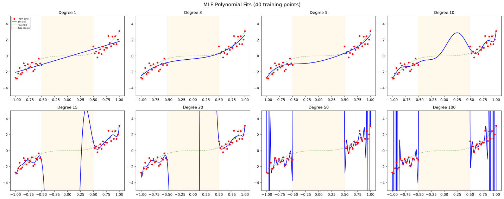

**What you should see:** Low-degree polynomials (like $D = 1$) are too simple and miss the curve (**underfitting** — like using a ruler to trace a winding road). High-degree polynomials (like $D = 100$) wiggle wildly, especially in the gap (**overfitting** — like memorizing answers instead of understanding the material). $D = 3$ is "just right" because the true function is cubic.

---

### Cell 8 — Q1 Discussion (Markdown)

This cell explains what we see in the plots:

- **Underfitting** ($D = 1$): A straight line can't capture the S-shaped cubic curve. The model is too simple.
- **Good fit** ($D = 3$): Matches the true function well because the true function *is* cubic.
- **Overfitting** ($D \geq 20$): The model has so many parameters that it can perfectly fit every noisy training point, but this "memorization" causes wild oscillations between and beyond the training points.
- In the gap region, overfit models are especially dangerous because there's no data to constrain them — they can predict anything.

> **Analogy:** Underfitting is like describing a person using only their height. Overfitting is like memorizing every freckle — useful for recognizing *that specific person*, but useless for recognizing people in general.

> **Deep Dive — The Bias-Variance Tradeoff**
>
> The expected prediction error at a test point $x$ can be decomposed as:
>
> $$\mathbb{E}[(y - \hat{f}(x))^2] = \underbrace{\text{Bias}^2[\hat{f}(x)]}_{\text{systematic error}} + \underbrace{\text{Var}[\hat{f}(x)]}_{\text{sensitivity to data}}$$
> $$ + \underbrace{\sigma^2}_{\text{irreducible noise}}$$
>
> where:
> - **Bias** $= \mathbb{E}[\hat{f}(x)] - f(x)$: How far off the *average* prediction is from the truth. High when the model is too simple (can't represent the true function).
> - **Variance** $= \mathbb{E}[(\hat{f}(x) - \mathbb{E}[\hat{f}(x)])^2]$: How much the prediction changes when trained on different datasets. High when the model is too complex (sensitive to noise).
>
> | Degree $D$ | Bias | Variance | Total Error |
> |-----------|------|----------|-------------|
> | $D = 1$ (linear) | High (can't fit cubic) | Low (few parameters) | High |
> | $D = 3$ (cubic) | Low (matches truth) | Low (just enough params) | **Lowest** |
> | $D = 100$ | Low (can fit anything) | Very high (too many params) | High |
>
> The optimal $D$ minimizes the *sum* of bias² and variance — this is the "sweet spot."

---

### Cell 9 — Q2 Instructions: Model Selection (Markdown)

Introduces **cross-validation by bootstrap** — a way to choose the best polynomial degree:

1. Randomly generate many train/validation dataset pairs.
2. For each pair, fit the model on train and measure error on validation.
3. Average the errors. Pick the degree at the "elbow" (where adding more complexity stops helping).

**Occam's Razor**: "The simplest explanation that fits the facts is the best one." Here: choose the lowest $D$ that still fits well.

### Cell 10 — Q2 Code: Cross-Validation by Bootstrap (Code)

```python
np.random.seed(42)
degrees = [1, 3, 5, 10, 15, 20, 50, 100]
S = 50  # number of bootstrap iterations
mse_results = {D: [] for D in degrees}
```

1. Fix the random seed for reproducibility.
2. Same degrees as before.
3. We'll repeat the experiment 50 times to get stable estimates.
4. Create a dictionary to store MSE results for each degree. A **dictionary** maps keys to values — here each degree maps to a list of MSE values.

```python
for s in range(S):
    x_tr, y_tr, _ = generate_data(number_of_points=20)
    x_val, y_val, _ = generate_data(number_of_points=20)
```

5. For each of 50 iterations, generate a *fresh* training set and a *fresh* validation set. The `_` means we don't need `x_test` here.

> **Why fresh datasets?** This simulates the real-world scenario: different datasets from the same data-generating process. It tests whether the model's performance is consistent, not just lucky on one dataset.

```python
    for D in degrees:
        poly = PolynomialFeatures(degree=D)
        X_tr_poly = poly.fit_transform(x_tr.reshape(-1, 1))
        X_val_poly = poly.transform(x_val.reshape(-1, 1))

        model = LinearRegression()
        model.fit(X_tr_poly, y_tr)
        y_pred = model.predict(X_val_poly)
        mse = np.mean((y_val - y_pred) ** 2)
        mse_results[D].append(mse)
```

6. For each degree, fit a polynomial model on the training data and predict on the validation data.
7. **MSE (Mean Squared Error)**: $\text{MSE} = \frac{1}{n} \sum_{i=1}^n (y_i - \hat{y}_i)^2$. It measures the average squared difference between predictions and actual values. Lower is better.
8. Store the MSE for this (degree, iteration) pair.

```python
mean_mse = [np.mean(mse_results[D]) for D in degrees]
std_mse = [np.std(mse_results[D]) for D in degrees]
```

9. Compute the mean and standard deviation of MSE across all 50 iterations for each degree.

```python
plt.figure(figsize=(8, 5))
plt.errorbar(range(len(degrees)), mean_mse, yerr=std_mse, marker='o', capsize=4)
plt.xticks(range(len(degrees)), degrees)
plt.xlabel('Polynomial Degree D')
plt.ylabel('Mean Validation MSE')
plt.title('Cross-Validation: MSE vs. Polynomial Degree')
plt.grid(True, alpha=0.3)
plt.show()
```

10. **`errorbar`** — Plots the mean MSE with error bars showing $\pm 1$ standard deviation. The error bars tell you how variable the MSE is across iterations.
11. `xticks` replaces numeric positions (0, 1, 2, ...) with the actual degree values.

```python
best_idx = np.argmin(mean_mse)
print(f'Optimal degree by cross-validation: D = {degrees[best_idx]}')
print(f'Mean MSE at optimal degree: {mean_mse[best_idx]:.4f}')
```

12. **`np.argmin`** — Finds the index of the smallest value. This tells us which degree has the lowest average validation error.

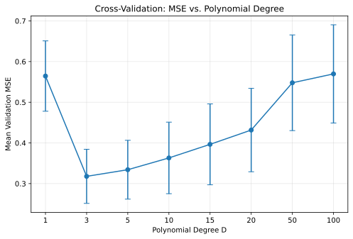

**Result:** $D = 3$ wins — as expected, since the true function is cubic.

---

### Cell 11 — Q2 Discussion (Markdown)

Explains why cross-validation works:

- It tests models on *held-out* data, so models that memorize noise (overfit) get caught.
- Averaging over 50 random splits makes the result robust.
- The "elbow" in the MSE plot implements Occam's Razor: the simplest model with good performance.

> **Deep Dive — Why Cross-Validation Estimates the Bias-Variance Tradeoff**
>
> When we compute the validation MSE, we are estimating the expected prediction error on new data:
>
> $$\text{MSE}_{\text{val}} \approx \text{Bias}^2 + \text{Variance} + \sigma^2$$
>
> - **Underfitting models** have high $\text{MSE}_{\text{val}}$ because of high bias (they can't represent the true function).
> - **Overfitting models** have high $\text{MSE}_{\text{val}}$ because of high variance (they're too sensitive to which specific data points were sampled).
> - The **minimum** of the MSE curve is the degree that best balances bias and variance.
>
> By averaging over $S = 50$ random train/validation splits, we reduce the noise in this estimate and get a reliable picture of the tradeoff.
>
> **Important caveat:** This CV procedure evaluates generalization on data from the *same distribution* as training. It does NOT tell us how the model will perform under covariate shift (in the gap). This is a recurring theme of the homework.

---

### Cell 12 — Q3 Instructions: Uncertainty Estimation (Markdown)

This long prompt introduces several crucial concepts:

- **Bootstrap**: Repeatedly resample the training data (with replacement), fit a model each time, and look at how much the predictions vary. High variation = high uncertainty.
- **Ensemble**: The collection of models from bootstrap resampling.
- **95% predictive interval**: The range within which 95% of the ensemble's predictions fall.
- **Ideal uncertainty**: Should be *low* where we have lots of data, and *high* in the gap where we have none.
- **Asymptotic properties of MLE**: As training data grows, MLE converges to the true parameters (**consistency**), meaning all bootstrap models agree — uncertainty collapses to zero everywhere, even where it shouldn't.

### Cell 13 — Q3 Code Part B: Bootstrap 95% Predictive Intervals (Code)

```python
np.random.seed(42)
x_train, y_train, x_test = generate_data(number_of_points=20)
degrees = [1, 3, 5, 10, 15, 20, 50, 100]
n_bootstrap = 200
```

1. Setup: fix seed, generate data, define degrees, set 200 bootstrap iterations.

```python
fig, axes = plt.subplots(2, 4, figsize=(20, 8))
```

2. Same 2×4 grid as before.

```python
for idx, D in enumerate(degrees):
    preds = []
    for b in range(n_bootstrap):
        boot_idx = np.random.choice(len(x_train), size=len(x_train), replace=True)
        x_b, y_b = x_train[boot_idx], y_train[boot_idx]
```

3. For each bootstrap iteration, **resample with replacement**: randomly pick training indices, allowing the same point to be picked multiple times. Some points appear multiple times, others not at all — this is the **bootstrap**.

> **Analogy:** Imagine you have 40 flashcards. You shuffle them, draw 40 cards *putting each back before drawing the next*. Some cards will appear twice or more, others won't appear at all. Each draw gives a slightly different study set.

```python
        poly = PolynomialFeatures(degree=D)
        X_b = poly.fit_transform(x_b.reshape(-1, 1))
        X_test_poly = poly.transform(x_test.reshape(-1, 1))

        model = LinearRegression()
        model.fit(X_b, y_b)
        preds.append(model.predict(X_test_poly))
```

4. Fit a polynomial model on this bootstrap sample and predict on the test points. Each bootstrap model gives slightly different predictions.

```python
    preds = np.array(preds)
    lower = np.percentile(preds, 2.5, axis=0)
    upper = np.percentile(preds, 97.5, axis=0)
    mean_pred = np.mean(preds, axis=0)
```

5. Stack all 200 predictions into a matrix (200 rows × number of test points columns).
6. **2.5th percentile** and **97.5th percentile** define the **95% predictive interval** — the range containing the middle 95% of bootstrap predictions.
7. The mean across all bootstrap models is our best single prediction.

```python
    ax = axes[idx // 4, idx % 4]
    ax.fill_between(x_test, lower, upper, alpha=0.3, color='steelblue', label='95% PI')
    ax.plot(x_test, mean_pred, 'b-', linewidth=1, label='Mean')
    ax.scatter(x_train, y_train, c='red', s=10, zorder=5, label='Train')
    ax.plot(x_test, 3 * x_test**3, 'g--', linewidth=0.8, alpha=0.5, label='True f(x)')
    ax.set_ylim(-5, 5)
    ax.set_title(f'Degree {D}')
    if idx == 0:
        ax.legend(fontsize=6)
```

8. **`fill_between`** — Shades the area between `lower` and `upper` in translucent blue. This is the 95% predictive interval — a visual representation of uncertainty.

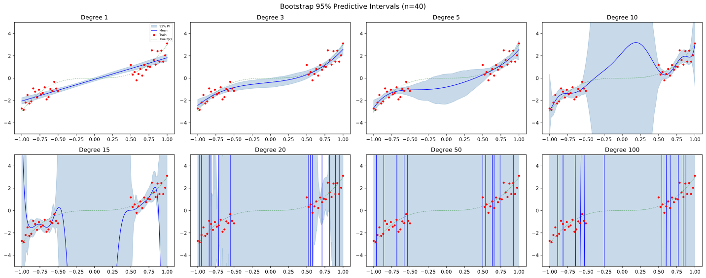

**What you should see:**
- For $D = 3$: narrow bands everywhere (low uncertainty), even in the gap. The model is confident but *wrong to be confident* in the gap.
- For $D = 10, 15$: wider bands in the gap (the ensemble disagrees there), narrower in training regions. This is closer to "ideal" uncertainty.
- For $D = 50, 100$: extremely wide, erratic bands.

---

### Cell 14 — Q3 Code Part C: Larger Datasets (Code)

```python
degrees = [1, 3, 5, 10, 15, 20, 50, 100]
n_points_list = [50, 100, 500, 1000]
n_bootstrap = 200
```

1. Now we test what happens when we have *more* training data.

```python
fig, axes = plt.subplots(len(n_points_list), len(degrees), figsize=(28, 14))
```

2. A 4×8 grid — rows are dataset sizes, columns are polynomial degrees.

The inner loop is the same bootstrap procedure as before. The key change:

```python
    np.random.seed(42)
    x_train_big, y_train_big, x_test_big = generate_data(number_of_points=n_pts)
```

3. Generate larger training sets (100, 200, 1000, 2000 total points).

```python
        ax.scatter(x_train_big[:40], y_train_big[:40], c='red', s=5, zorder=5)
```

4. Only plot the first 40 training points to avoid cluttering the plot (the full dataset is used for fitting).


**What you should see:** As training data grows:
- **Training regions**: Bands shrink → all bootstrap models agree → uncertainty vanishes. This is MLE **consistency**: with enough data, MLE converges to the true parameters.
- **Gap region**: Bands *also* shrink! This is the problem — even though there's still *no data* in the gap, the model becomes falsely confident there.

---

### Cell 15 — Q3 Discussion (Markdown)

This discussion explains the key findings:

- **Ideal uncertainty**: High in the gap, low in training regions — this would let doctors know when to trust the model.
- **MLE bootstrap fails**: With abundant data, bootstrap uncertainty collapses *everywhere*, including the gap. It cannot distinguish "I know this" from "I'm guessing."
- This is a **fundamental limitation** of bootstrap MLE ensembles for uncertainty estimation under covariate shift.

> **Deep Dive — MLE Consistency and Why Bootstrap Uncertainty Collapses**
>
> **MLE consistency** is a fundamental theorem: as $N \to \infty$, the MLE converges in probability to the true parameter:
>
> $$\hat{\mathbf{w}}_{\text{MLE}} \xrightarrow{P} \mathbf{w}_{\text{true}} \quad \text{as } N \to \infty$$
>
> Furthermore, the distribution of the MLE is asymptotically normal with variance shrinking as $O(1/N)$:
>
> $$\sqrt{N}(\hat{\mathbf{w}}_{\text{MLE}} - \mathbf{w}_{\text{true}}) \xrightarrow{d} \mathcal{N}(0, I(\mathbf{w}_{\text{true}})^{-1})$$
>
> where $I(\mathbf{w})$ is the **Fisher information matrix**. Since bootstrap variance estimates this same asymptotic variance, it also shrinks as $O(1/N)$.
>
> **The problem:** This convergence happens for the *parameters*, which then determines predictions *everywhere* — including the gap. Even though no data was observed in the gap, the polynomial passes through the gap with a uniquely determined shape once the parameters are fixed. All bootstrap models converge to the same parameters → the same predictions in the gap → zero variance in the gap.
>
> In contrast, a Bayesian model can maintain separate uncertainty about the *function value* in the gap, even as parameter uncertainty decreases. This is because the posterior predictive variance $\phi(x^*)^\top \Sigma_N \phi(x^*)$ depends on the *direction* $\phi(x^*)$, not just the overall parameter precision.

---

### Cell 16 — Q4 Instructions: Ridge Regularization (Markdown)

Introduces **$\ell_2$ regularization** (Ridge regression). Instead of just minimizing squared errors, Ridge adds a penalty:

$$\text{Loss} = \sum_{i=1}^n (y_i - \hat{y}_i)^2 + \alpha \sum_{d=0}^D w_d^2$$

The penalty $\alpha \sum w_d^2$ discourages large weights. Larger $\alpha$ → stronger penalty → simpler model. Think of it as putting the model on a "diet" — it can't make extreme predictions.

### Cell 17 — Q4 Code: Ridge Bootstrap Grid (Code)

```python
np.random.seed(42)
x_train, y_train, x_test = generate_data(number_of_points=20)

degrees = [1, 3, 5, 10, 15, 20, 50, 100]
alphas = [5e-3, 1e-2, 1e-1, 1e0, 1e1]
n_bootstrap = 200
```

1. Setup with 5 regularization strengths and 8 polynomial degrees.

```python
fig, axes = plt.subplots(len(alphas), len(degrees), figsize=(28, 16))
```

2. A 5×8 grid — rows are $\alpha$ values, columns are degrees.

The inner loop is nearly identical to the bootstrap code above, except:

```python
            model = Ridge(alpha=alpha)
            model.fit(X_b, y_b)
```

3. **`Ridge(alpha=alpha)`** — Uses Ridge regression instead of ordinary least squares. The `alpha` parameter controls the regularization strength.

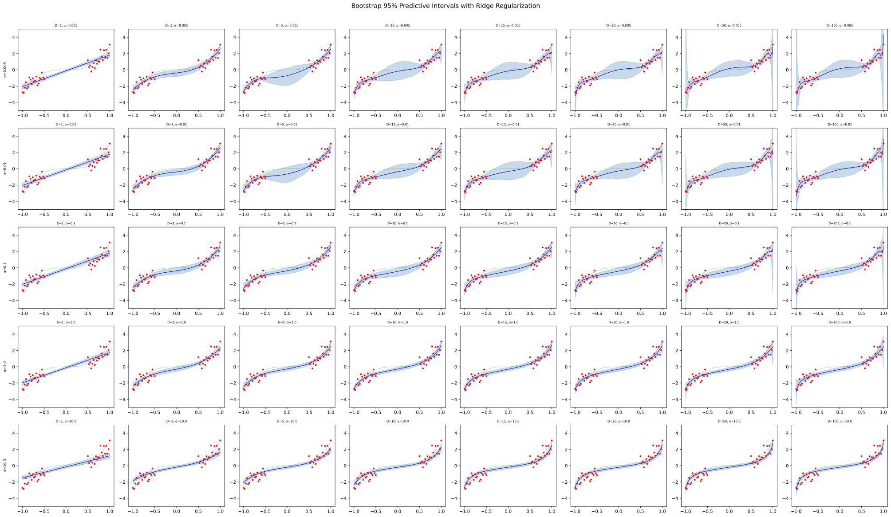

**What you should see:**
- **Weak regularization** (small $\alpha$): Similar to unregularized — high-$D$ polynomials still overfit, wide bands in the gap.
- **Strong regularization** (large $\alpha$): All weights are shrunk toward zero, so all bootstrap models look very similar → *narrow bands everywhere, including the gap*. The uncertainty is suppressed uniformly.

---

### Cell 18 — Q4 Discussion (Markdown)

Key insight: **Regularization and useful uncertainty are competing goals.**

- Regularization forces bootstrap models to be similar → less ensemble disagreement → narrower intervals.
- This happens *uniformly* — it doesn't know to keep uncertainty high in the gap.
- In safety-critical settings, we want the model to "know what it doesn't know." Regularization masks this signal.

> **Connection — Ridge Regression is Bayesian MAP Estimation**
>
> The Ridge regression objective is:
>
> $$\hat{\mathbf{w}}_{\text{Ridge}} = \arg\min_{\mathbf{w}} \left[\sum_{i=1}^N (y_i - \mathbf{w}^\top \phi(x_i))^2 + \alpha \|\mathbf{w}\|^2\right]$$
>
> This is *identical* to finding the **maximum a posteriori** (MAP) estimate of a Bayesian model with prior $\mathbf{w} \sim \mathcal{N}(0, \frac{\sigma^2}{\alpha} I)$:
>
> $$\hat{\mathbf{w}}_{\text{MAP}} = \arg\max_{\mathbf{w}} \left[\log p(\mathbf{y} | \Phi, \mathbf{w}) + \log p(\mathbf{w})\right]$$
>
> The key difference: Ridge gives you only the *point estimate* (one best guess), while the full Bayesian approach gives you the entire *posterior distribution* (a range of plausible guesses with their probabilities). This is why Ridge produces overconfident bootstrap intervals — it finds one answer and sticks with it, whereas Bayesian inference preserves the full spread of uncertainty.

---

### Check Your Understanding — Part I

<details>
<summary><strong>Q1:</strong> You have 40 training points and fit a polynomial of degree $D = 50$. How many parameters does the model have? Why is this problematic?</summary>

The model has $D + 1 = 51$ parameters (weights $w_0, w_1, \ldots, w_{50}$), but only 40 data points. This means the system is **underdetermined** — there are infinitely many weight vectors that perfectly fit the training data (the system $\Phi \mathbf{w} = \mathbf{y}$ has more unknowns than equations). The MLE picks one such solution (typically the minimum-norm one), but any of the others would also have zero training error. Different bootstrap samples pick different solutions from this infinite set, leading to wildly different predictions in the gap.
</details>

<details>
<summary><strong>Q2:</strong> Cross-validation selects $D = 3$ as optimal. Does this mean $D = 3$ will produce the best *uncertainty estimates*? Explain why or why not.</summary>

**No.** Cross-validation selects the degree with the best *predictive accuracy on data from the same distribution*. It does not evaluate uncertainty quality. As shown in the bootstrap plots, $D = 3$ produces narrow predictive intervals everywhere — including the gap, where uncertainty should be high. Higher degrees like $D = 10$ or $D = 15$ produce wider (more honest) intervals in the gap. The optimal model for *prediction* and the optimal model for *uncertainty* are different things.
</details>

<details>
<summary><strong>Q3:</strong> Write the Ridge regression closed-form solution. What happens as $\alpha \to 0$? As $\alpha \to \infty$?</summary>

$$\hat{\mathbf{w}}_{\text{Ridge}} = (\Phi^\top \Phi + \alpha I)^{-1} \Phi^\top \mathbf{y}$$

- **$\alpha \to 0$**: The penalty vanishes, and Ridge converges to OLS/MLE: $(\Phi^\top \Phi)^{-1} \Phi^\top \mathbf{y}$.
- **$\alpha \to \infty$**: The penalty dominates, shrinking all weights to zero: $\hat{\mathbf{w}} \to \mathbf{0}$. The model predicts $\hat{y} \approx 0$ everywhere.
</details>

---

## 3. Part II: Bayesian Polynomial Regression (Cells 19–31)

### Cell 19 — Part II Introduction (Markdown)

Introduces the Bayesian version of polynomial regression:

$$y = \mathbf{w}^\top \phi(\mathbf{x}) + \epsilon, \quad \epsilon \sim \mathcal{N}(0, 0.3)$$

$$w_d \sim \mathcal{N}(0, \alpha)$$

Key differences from MLE (Part I):

- In MLE, we find a *single best* set of weights. In Bayesian inference, we maintain a *distribution* over all possible weights.
- The **prior** $\mathcal{N}(0, \alpha)$ represents our beliefs *before* seeing data. $\alpha$ controls how spread out our beliefs are.
- The **posterior** represents our updated beliefs *after* seeing data.
- Instead of one prediction, we get a *distribution* of predictions, naturally giving us uncertainty.

> **Analogy:** MLE is like betting everything on one horse. Bayesian inference is like spreading your bets across multiple horses based on how likely each is to win, then updating your bets as the race progresses.

### Cell 20 — Q1 Instructions: Bayesian Kernel Regression (Markdown)

Explains the **feature map** $\phi$:

$$\phi: \mathbb{R} \to \mathbb{R}^D, \quad x \mapsto [1, x, x^2, \ldots, x^D]$$

This is exactly what `PolynomialFeatures` does. The key insight: once you apply $\phi$, Bayesian polynomial regression *is* Bayesian linear regression on the transformed features.

The cell asks you to derive the **posterior** in closed form.

### Cell 21 — Q1 Answer: Posterior Derivation (Markdown)

This derives the posterior for Bayesian linear regression. Let's break down the math for beginners:

**Prior:**
$$p(\mathbf{w}) = \mathcal{N}(\mathbf{0}, \alpha I)$$
"Before seeing data, we believe the weights are centered at zero with variance $\alpha$ in each direction."

**Likelihood:**
$$p(\mathbf{y} | \Phi, \mathbf{w}) = \prod_{i=1}^N \mathcal{N}(y_i | \mathbf{w}^\top \phi(\mathbf{x}_i), \sigma^2)$$
"The probability of seeing the observed data, given specific weights."

**Posterior (by Bayes' theorem):**
$$p(\mathbf{w} | \mathbf{y}, \Phi) = \mathcal{N}(\mu_N, \Sigma_N)$$

where:

$$\Sigma_N = \left(\frac{1}{\alpha} I + \frac{1}{\sigma^2} \Phi^\top \Phi \right)^{-1}$$

$$\mu_N = \frac{1}{\sigma^2} \Sigma_N \Phi^\top \mathbf{y}$$

**Intuition for the posterior covariance $\Sigma_N$:**
- $\frac{1}{\alpha} I$ = precision from the prior (how tightly the prior constrains the weights).
- $\frac{1}{\sigma^2} \Phi^\top \Phi$ = precision from the data (how much information the data provides).
- We *add* these precisions: more information (from prior or data) = more precise (less uncertain) posterior.
- Inverting the total precision gives the posterior covariance (uncertainty).

**Intuition for the posterior mean $\mu_N$:**
- It's a compromise between the prior mean (zero) and the data-driven estimate.
- With lots of data, $\frac{1}{\sigma^2} \Phi^\top \Phi$ dominates, and the posterior mean approaches the MLE solution.
- With little data, the prior "pulls" the mean toward zero.

**Posterior predictive** (for a new test input $\mathbf{x}^*$):

$$p(y^* | \mathbf{x}^*, \text{Data}) = \mathcal{N}\left(\mu_N^\top \phi(\mathbf{x}^*), \; \sigma^2 + \phi(\mathbf{x}^*)^\top \Sigma_N \phi(\mathbf{x}^*)\right)$$

The predictive variance has two terms:
- $\sigma^2$: **aleatoric uncertainty** (irreducible noise in the data).
- $\phi(\mathbf{x}^*)^\top \Sigma_N \phi(\mathbf{x}^*)$: **epistemic uncertainty** (uncertainty due to not knowing the weights perfectly). This term is *large* in the gap (where data is scarce) and *small* in training regions.

> **Deep Dive — Worked Numerical Example (1D, $D = 1$)**
>
> Suppose we have just 2 training points: $(x_1 = -1, y_1 = -3)$ and $(x_2 = 1, y_2 = 3)$. Let $D = 1$ (linear), $\alpha = 1$, $\sigma^2 = 0.3$.
>
> The feature matrix is: $\Phi = \begin{bmatrix} 1 & -1 \\ 1 & 1 \end{bmatrix}$
>
> **Step 1 — Prior precision:** $\frac{1}{\alpha}I = \begin{bmatrix} 1 & 0 \\ 0 & 1 \end{bmatrix}$
>
> **Step 2 — Data precision:** $\frac{1}{\sigma^2}\Phi^\top \Phi = \frac{1}{0.3}\begin{bmatrix} 2 & 0 \\ 0 & 2 \end{bmatrix} = \begin{bmatrix} 6.67 & 0 \\ 0 & 6.67 \end{bmatrix}$
>
> **Step 3 — Posterior precision:** $\Lambda_N = \begin{bmatrix} 7.67 & 0 \\ 0 & 7.67 \end{bmatrix}$
>
> **Step 4 — Posterior covariance:** $\Sigma_N = \Lambda_N^{-1} = \begin{bmatrix} 0.130 & 0 \\ 0 & 0.130 \end{bmatrix}$
>
> **Step 5 — Posterior mean:** $\mu_N = \frac{1}{0.3}\Sigma_N \Phi^\top \mathbf{y} = \frac{1}{0.3}\begin{bmatrix} 0.130 & 0 \\ 0 & 0.130 \end{bmatrix}\begin{bmatrix} 0 \\ 6 \end{bmatrix} = \begin{bmatrix} 0 \\ 2.60 \end{bmatrix}$
>
> So the posterior is: $\mathbf{w} | \text{Data} \sim \mathcal{N}\left(\begin{bmatrix} 0 \\ 2.60 \end{bmatrix}, \begin{bmatrix} 0.130 & 0 \\ 0 & 0.130 \end{bmatrix}\right)$
>
> The intercept is near 0 and the slope is near 3 (the true value) — the prior pulled the slope slightly toward 0 (from the MLE of 3.0 to the posterior mean of 2.60).

> **Deep Dive — Bayes' Theorem in Plain English**
>
> Bayes' theorem is the mathematical formula for updating beliefs:
>
> $$\underbrace{p(\mathbf{w} | \text{Data})}_{\text{Posterior}} = \frac{\overbrace{p(\text{Data} | \mathbf{w})}^{\text{Likelihood}} \times \overbrace{p(\mathbf{w})}^{\text{Prior}}}{\underbrace{p(\text{Data})}_{\text{Evidence}}}$$
>
>*Posterior*: what we believe after seeing data
>
>*Likelihood*: how well **w** explains the data
>
>*Prior*: what we believed before
>
>*Evidence*: normalizing constant
>
> The denominator $p(\text{Data})$ doesn't depend on $\mathbf{w}$ — it just ensures the posterior integrates to 1. That's why we often write $p(\mathbf{w} | \text{Data}) \propto p(\text{Data} | \mathbf{w}) \cdot p(\mathbf{w})$.

---

### Cell 22 — Q2 Instructions (Markdown)

Asks to visualize the 95% posterior predictive interval for all combinations of $D = [1,3,5,10,15,20,50,100]$ and $\alpha = [0.1, 1, 5, 10, 100]$.

Also introduces **Random Fourier Features** as extra credit — a non-polynomial feature map that approximates a **Gaussian Process** as the number of features grows.

### Cell 23 — Q2 Code: Bayesian Posterior Predictive Grid (Code)

```python
degrees = [1, 3, 5, 10, 15, 20, 50, 100]
alphas_bay = [0.1, 1, 5, 10, 100]
noise_var = 0.3
```

1. Setup: 8 degrees, 5 prior variances, known noise variance.

```python
np.random.seed(42)
x_train, y_train, x_test = generate_data(number_of_points=20)
```

2. Generate the same dataset as before (seed ensures reproducibility).

```python
fig, axes = plt.subplots(len(alphas_bay), len(degrees), figsize=(28, 16))
```

3. A 5×8 grid of subplots.

```python
for i, alpha in enumerate(alphas_bay):
    for j, D in enumerate(degrees):
        poly = PolynomialFeatures(degree=D)
        Phi_train = poly.fit_transform(x_train.reshape(-1, 1))
        Phi_test = poly.transform(x_test.reshape(-1, 1))
```

4. Create polynomial features — the $\Phi$ matrix from the theory.

```python
        try:
            post_pred, post_pred_samples = get_posterior_samples(
                prior_var=alpha, noise_var=noise_var,
                x_matrix=Phi_train, y_matrix=y_train,
                x_test_matrix=Phi_test, samples=200
            )
```

5. Call the `get_posterior_samples` function from Cell 4. **Important:** we pass the *transformed* features (`Phi_train`, `Phi_test`), not the raw inputs. The function:
   - Computes the posterior $\mathcal{N}(\mu_N, \Sigma_N)$
   - Draws 200 weight samples from the posterior
   - Computes predictions at test points
   - Adds observation noise to get posterior predictive samples

6. The `try/except` handles cases where the matrix inversion might fail (numerically singular matrices for very high $D$).

```python
            lower = np.percentile(post_pred_samples, 2.5, axis=0)
            upper = np.percentile(post_pred_samples, 97.5, axis=0)
            mean_pred = np.mean(post_pred, axis=0)
```

7. Compute the 95% predictive interval from the samples, just as with bootstrap.

The plotting code is the same pattern as before (fill_between, scatter, etc.).

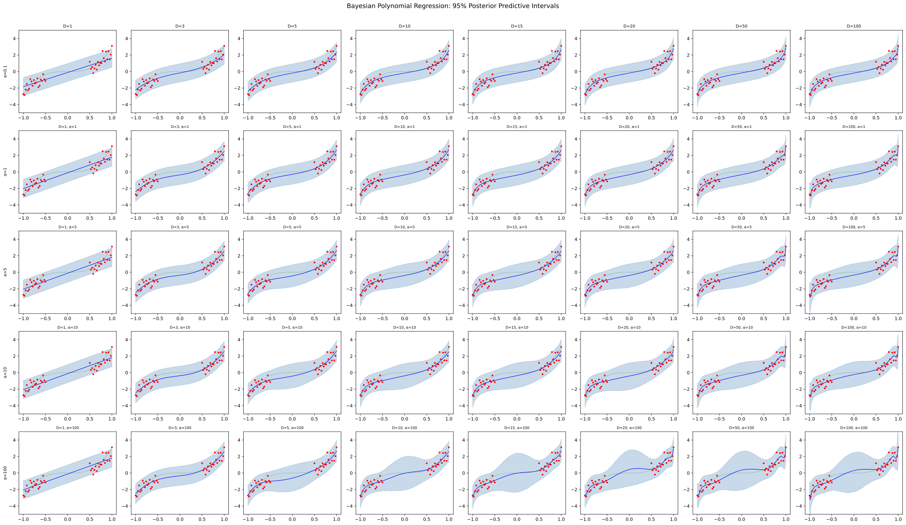

**What you should see:**
- **Small $\alpha$** (e.g., 0.1): Narrow intervals everywhere — the tight prior constrains the model.
- **Large $\alpha$** (e.g., 100) + high $D$: Wide intervals in the gap, narrow in training regions. **This is the ideal behavior!** The Bayesian model naturally expresses high uncertainty where data is missing.

---

### Cell 24 — Q2 Discussion (Markdown)

Summarizes the roles of $\alpha$ and $D$:

- **$\alpha$ (prior variance)**: Controls "default" uncertainty. Large $\alpha$ = "I don't have strong beliefs" → high uncertainty in data-poor regions.
- **$D$ (degree)**: Controls expressiveness. More features = more possible functions = more uncertainty in under-constrained regions.
- **Best combination**: Moderate-to-high $D$ with moderate-to-high $\alpha$ gives the desirable pattern of tight-where-data, wide-where-gap.

> **Deep Dive — Why the Bayesian Predictive Variance Widens in the Gap**
>
> The predictive variance at a test point $x^*$ is:
>
> $$\text{Var}(y^* | x^*) = \sigma^2 + \phi(x^*)^\top \Sigma_N \phi(x^*)$$
>
> The second term depends on how well the posterior constrains predictions at $x^*$. Consider two extreme cases:
>
> **Case 1 — $x^*$ in the training region:** The features $\phi(x^*)$ are "well-represented" by the training data matrix $\Phi$, so $\Phi^\top \Phi$ contains strong information about these directions. The posterior precision is high in these directions → $\Sigma_N$ is small in these directions → the quadratic form $\phi(x^*)^\top \Sigma_N \phi(x^*)$ is small.
>
> **Case 2 — $x^*$ in the gap:** The features $\phi(x^*)$ may point in directions that $\Phi^\top \Phi$ knows little about. The posterior is constrained only by the prior in these directions → $\Sigma_N$ is large → the quadratic form is large → wide predictive intervals.
>
> Mathematically, if we eigen-decompose $\Phi^\top \Phi = V \Lambda V^\top$, the posterior variance in direction $v_k$ is approximately $\frac{1}{1/\alpha + \lambda_k/\sigma^2}$. Directions with large eigenvalues $\lambda_k$ (well-represented in data) have small posterior variance. Directions with small eigenvalues (poorly represented) retain the prior variance $\alpha$.

---

### Cell 25 — Q3 Instructions: Log-Likelihood (Markdown)

Introduces the **log posterior predictive likelihood** — a way to score how well the Bayesian model explains the data:

$$\log p(\mathbf{y} | \text{Data}) = \sum_{m=1}^M \log p(y_m^* | x_m^*, \text{Data})$$

Each term asks: "Given everything we know, how probable is this observed data point?"

For Bayesian linear regression:

$$p(y_m^* | x_m^*, \text{Data}) = \mathcal{N}\left(\mu_N^\top \phi(x_m^*), \; \sigma^2 + \phi(x_m^*)^\top \Sigma_N \phi(x_m^*)\right)$$

### Cell 26 — Q3 Code: Log-Likelihood Heatmap (Code)

```python
from scipy.stats import norm
```

1. Import the normal distribution from SciPy — we need `norm.logpdf` to compute log-probabilities.

```python
degrees = [1, 3, 5, 10, 15, 20, 50, 100]
alphas_bay = [0.1, 1, 5, 10, 100]
noise_var = 0.3
```

2. Same setup as before.

```python
log_lik_table = np.zeros((len(alphas_bay), len(degrees)))
```

3. Create a 5×8 matrix to store log-likelihood values.

```python
for i, alpha in enumerate(alphas_bay):
    for j, D in enumerate(degrees):
        poly = PolynomialFeatures(degree=D)
        Phi_train = poly.fit_transform(x_train.reshape(-1, 1))

        d_feat = Phi_train.shape[1]
        prior_prec = np.eye(d_feat) / alpha
        Sigma_N = np.linalg.inv(prior_prec + Phi_train.T @ Phi_train / noise_var)
        mu_N = (Sigma_N @ Phi_train.T @ y_train) / noise_var
```

4. Manually compute the posterior parameters (same formulas as in `get_posterior_samples`, but done explicitly here):
   - `prior_prec = I / α` — prior precision matrix.
   - `Sigma_N` — posterior covariance.
   - `mu_N` — posterior mean.
   - The `@` operator is Python's matrix multiplication.

```python
        ll = 0.0
        for n in range(len(x_train)):
            phi_n = Phi_train[n]
            pred_mean = mu_N @ phi_n
            pred_var = noise_var + phi_n @ Sigma_N @ phi_n
            ll += norm.logpdf(y_train[n], loc=pred_mean, scale=np.sqrt(np.abs(pred_var)))
        log_lik_table[i, j] = ll
```

5. For each training point, compute:
   - **Predictive mean**: $\mu_N^\top \phi(x_n)$
   - **Predictive variance**: $\sigma^2 + \phi(x_n)^\top \Sigma_N \phi(x_n)$
   - **Log-probability**: `norm.logpdf(y, loc=mean, scale=std)` computes $\log \mathcal{N}(y | \text{mean}, \text{std}^2)$
6. Sum up all log-probabilities to get the total log-likelihood. `np.abs` prevents issues with negative variances from numerical errors.

```python
ll_df = pd.DataFrame(log_lik_table, ...)
print(ll_df.round(2))
```

7. Display the results as a formatted table using Pandas.

The heatmap code uses `plt.imshow` to visualize the table as a color grid, with text annotations in each cell.

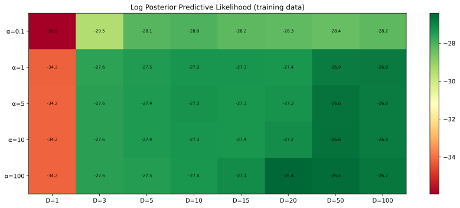

---

### Cell 27 — Q3 Discussion (Markdown)

Key insight: **Higher log-likelihood does NOT mean better uncertainty.**

- Log-likelihood measures how well the model fits the *training data* — it rewards models that are sharp (confident) and correct *where data exists*.
- It tells us nothing about the gap region, because there's no data there to evaluate.
- A model can have excellent log-likelihood but completely unreliable uncertainty in the gap.

> **Deep Dive — Why Sharper Models Get Higher Log-Likelihood**
>
> The log-likelihood of a single point under a Gaussian predictive distribution is:
>
> $$\log p(y | \mu, \sigma_{\text{pred}}^2) = -\frac{1}{2}\log(2\pi\sigma_{\text{pred}}^2) - \frac{(y - \mu)^2}{2\sigma_{\text{pred}}^2}$$
>
> The first term rewards **small predictive variance** (sharpness) — a model that says "I'm very sure" gets a bonus from the $-\log(\sigma_{\text{pred}}^2)$ term. The second term penalizes **inaccuracy** — but only at observed data points. A model with high $D$ and high $\alpha$ can achieve high log-likelihood by being sharp and accurate on training points, while having wildly uncertain (or wildly wrong) predictions in the gap — which the log-likelihood never checks.
>
> This is a specific instance of a general problem: **in-distribution metrics cannot evaluate out-of-distribution behavior**.

---

### Cell 28 — Q4 Instructions: Bayesian vs Frequentist Uncertainty (Markdown)

This prompt asks for a comparison of the two approaches to uncertainty we've seen.

### Cell 29 — Q4 Answer: Bayesian vs Frequentist (Markdown)

A detailed comparison:

**Bootstrap (Frequentist) advantages:**
- Works with any model (neural networks, trees, etc.) — no need for mathematical tractability.
- No prior to specify — avoids the risk of wrong assumptions.

**Bootstrap (Frequentist) disadvantages:**
- Uncertainty collapses with more data, even in the gap (MLE consistency).
- Can't distinguish "I know this" from "I'm guessing."

**Bayesian advantages:**
- Naturally gives high uncertainty where data is sparse (the posterior stays wide).
- Can encode expert knowledge via the prior.

**Bayesian disadvantages:**
- Requires specifying a prior — if wrong, the uncertainty can be misleading.
- Computationally expensive for complex models (exact inference only works for simple cases like linear regression).

**When to use which:**
- **Bootstrap**: Large datasets, complex models, no expert knowledge available.
- **Bayesian**: Small datasets, expert knowledge available, need to detect covariate shift.

---

### Cell 30 — Q5 Instructions: Measuring Uncertainty (Markdown)

Asks the deep question: How do we measure whether uncertainty is "good"?

### Cell 31 — Q5 Answer: Measuring Uncertainty (Markdown)

Key points:

- **MSE and log-likelihood are NOT appropriate** for evaluating uncertainty under covariate shift — they only measure performance on the training distribution.
- **Common best practices (CV, regularization) actually *hurt* uncertainty estimation** — they optimize for in-distribution accuracy, which suppresses useful uncertainty signals.
- **Good uncertainty** means **calibration**: when the model says "I'm 95% confident," it should be right about 95% of the time — not just on average, but across all regions of the input space.

Formally, the gold standard is **conditional coverage**:

$$P(y \in C_\alpha(x) | x) \geq 1 - \alpha \quad \text{for all } x$$

This means: for *every* input $x$ (including the gap), the prediction interval should contain the true value with the stated probability.

> **Deep Dive — Marginal vs. Conditional Coverage**
>
> There are two notions of "good" coverage:
>
> **Marginal coverage** (weaker): $P(y \in C_\alpha(x)) \geq 1 - \alpha$
> The interval covers the true value on average over the input distribution. You could have 99% coverage on easy inputs and 50% on hard inputs, and still satisfy marginal coverage if easy inputs dominate.
>
> **Conditional coverage** (stronger): $P(y \in C_\alpha(x) | x) \geq 1 - \alpha$ for all $x$
> The interval covers at *every* individual input. This is what we'd ideally want for safety-critical systems — a patient in the gap region deserves the same coverage guarantee as one in the data-rich region.
>
> Unfortunately, **conditional coverage is impossible to achieve** without strong assumptions (proven by Vovk, 2012; Barber et al., 2021). Conformal prediction achieves marginal coverage. Bayesian methods *approximate* conditional coverage when the model is correctly specified, but may fail otherwise. This impossibility result is a deep and important theoretical limitation.

---

### Check Your Understanding — Part II

<details>
<summary><strong>Q1:</strong> In the Bayesian posterior, what happens to $\Sigma_N$ as the number of training points $N \to \infty$?</summary>

The posterior covariance shrinks to zero:

$$\Sigma_N = \left(\frac{1}{\alpha} I + \frac{1}{\sigma^2} \Phi^\top \Phi\right)^{-1} \to \left(\frac{1}{\sigma^2} \Phi^\top \Phi\right)^{-1} \cdot \frac{1}{N} \to 0$$

as $N \to \infty$ (since $\Phi^\top \Phi$ grows linearly with $N$ in the data-rich region). The posterior concentrates on a single point — the Bayesian estimate converges to the MLE. This is called **Bayesian consistency** or the **Bernstein–von Mises theorem**.

**But** — this only happens in regions where data is abundant. In the gap, $\Phi^\top \Phi$ has limited rank information about the gap region, so the posterior stays wide there. This is precisely why Bayesian uncertainty is more useful than bootstrap uncertainty under covariate shift.
</details>

<details>
<summary><strong>Q2:</strong> What is the difference between epistemic and aleatoric uncertainty? Which can be reduced by collecting more data?</summary>

- **Aleatoric (irreducible)** uncertainty $= \sigma^2$: The noise inherent in the data-generating process. Even if you knew the true function $f(x)$ perfectly, observations would still scatter around it with variance $\sigma^2$. **Cannot be reduced** by more data.

- **Epistemic (reducible)** uncertainty $= \phi(x)^\top \Sigma_N \phi(x)$: Uncertainty about the model parameters due to limited data. As you collect more data, $\Sigma_N$ shrinks, and this term decreases. **Can be reduced** by more data (in the regions where data is collected).

Total predictive variance: $\text{Var}(y^* | x^*) = \underbrace{\sigma^2}_{\text{aleatoric}} + \underbrace{\phi(x^*)^\top \Sigma_N \phi(x^*)}_{\text{epistemic}}$
</details>

<details>
<summary><strong>Q3:</strong> If you set the prior variance $\alpha \to \infty$, what happens to the Bayesian posterior mean? What about $\alpha \to 0$?</summary>

**$\alpha \to \infty$ (infinitely vague prior):**

$$\mu_N \to \left(\Phi^\top \Phi\right)^{-1} \Phi^\top \mathbf{y} = \hat{\mathbf{w}}_{\text{MLE}}$$

The prior has no influence, and the posterior mean equals the MLE solution. The Bayesian model "trusts the data completely."

**$\alpha \to 0$ (infinitely tight prior):**

$$\mu_N \to \mathbf{0}$$

The prior dominates — the model ignores the data and predicts everything as zero. This is extreme regularization.
</details>

---

## 4. Part III: Calibration & Posterior Predictive Checks (Cells 32–47)

### Cell 32 — Part III Header (Markdown)

Introduces Part III and notes that helper functions are provided.

### Cell 33 — Helper Functions (Code)

Four utility functions are defined. Let's go through each.

#### `reliability_diagram`

```python
def reliability_diagram(probs, y_true, n_bins=10, title=None):
    """Plot a reliability diagram using confidence bins (binary case)."""
```

A **reliability diagram** is the primary visual tool for checking **calibration** — whether predicted probabilities match observed frequencies.

```python
    probs = np.asarray(probs)
    y_true = np.asarray(y_true)
    bins = np.linspace(0.0, 1.0, n_bins + 1)
```

1. Convert inputs to NumPy arrays.
2. Create bin edges: for `n_bins=10`, bins are $[0, 0.1, 0.2, \ldots, 1.0]$.

```python
    bin_ids = np.digitize(probs, bins) - 1
    bin_ids = np.clip(bin_ids, 0, n_bins - 1)
```

3. **`np.digitize`** assigns each predicted probability to a bin. Subtract 1 because bins are 0-indexed.
4. **`np.clip`** ensures bin indices stay within valid range.

```python
    conf = np.zeros(n_bins)
    acc = np.zeros(n_bins)
    counts = np.zeros(n_bins)

    for b in range(n_bins):
        mask = bin_ids == b
        counts[b] = mask.sum()
        if counts[b] > 0:
            conf[b] = probs[mask].mean()
            acc[b] = y_true[mask].mean()
        else:
            conf[b] = np.nan
            acc[b] = np.nan
```

5. For each bin:
   - **`conf[b]`**: Average predicted probability of examples in this bin (the model's stated confidence).
   - **`acc[b]`**: Fraction of examples in this bin where the actual outcome was positive (the empirical frequency).
   - If the model is perfectly calibrated, `conf[b]` should equal `acc[b]` for every bin.

```python
    plt.figure()
    plt.plot([0, 1], [0, 1])
    plt.scatter(conf, acc)
```

6. The diagonal line $y = x$ represents **perfect calibration**. Points above the line mean the model is **underconfident** (actual frequency > predicted probability). Points below mean **overconfident**.

> **Analogy:** If a weather app says "70% chance of rain" and it actually rains 90% of such days, the app is underconfident. If it rains only 50% of such days, it's overconfident.

#### `ece_binary`

```python
def ece_binary(probs, y_true, n_bins=10):
    """Expected Calibration Error (ECE) for binary classification."""
```

**Expected Calibration Error** is a single number summarizing how well-calibrated a model is:

$$\text{ECE} = \sum_{b=1}^{B} \frac{n_b}{N} \left| \text{acc}(b) - \text{conf}(b) \right|$$

- For each bin $b$: compute the absolute gap between accuracy and confidence.
- Weight by the fraction of samples in that bin.
- Lower ECE = better calibration. ECE = 0 means perfect calibration.

```python
    ece = 0.0
    n = len(y_true)
    for b in range(n_bins):
        mask = bin_ids == b
        if mask.sum() == 0:
            continue
        acc = y_true[mask].mean()
        conf = probs[mask].mean()
        ece += (mask.sum() / n) * abs(acc - conf)
    return float(ece)
```

7. Loops over bins, skipping empty ones, and accumulates the weighted absolute differences.

#### `brier_binary`

```python
def brier_binary(probs, y_true):
    probs = np.asarray(probs)
    y_true = np.asarray(y_true)
    return float(np.mean((probs - y_true)**2))
```

The **Brier score** is the mean squared difference between predicted probabilities and actual outcomes (0 or 1):

$$\text{Brier} = \frac{1}{N} \sum_{i=1}^N (p_i - y_i)^2$$

- Lower is better. Range: $[0, 1]$.
- It combines calibration AND discrimination (the ability to separate positives from negatives).

#### `temperature_scale`

```python
def temperature_scale(logits, T):
    """Binary temperature scaling on logits."""
    logits = np.asarray(logits)
    return 1 / (1 + np.exp(-logits / T))
```

**Temperature scaling** is a post-hoc calibration technique:

1. **Logits** are the raw model outputs *before* the sigmoid function. If the model outputs $z$, the probability is $\sigma(z) = 1/(1 + e^{-z})$.
2. Dividing by temperature $T$ adjusts confidence:
   - $T > 1$: "Cools down" predictions → less confident (probabilities move toward 0.5).
   - $T < 1$: "Heats up" predictions → more confident (probabilities move toward 0 or 1).
   - $T = 1$: No change.
3. The formula becomes: $p = \sigma(z / T) = \frac{1}{1 + e^{-z/T}}$.

> **Analogy:** Temperature scaling is like adjusting the volume knob on the model's confidence. Too loud (overconfident)? Turn it down ($T > 1$). Too quiet (underconfident)? Turn it up ($T < 1$).

---

### Cell 34 — Classification Setup Instructions (Markdown)

Explains that we'll train a classifier, then evaluate its calibration using the tools above.

### Cell 35 — Classification Pipeline (Code)

```python
X, y = make_classification(
    n_samples=8000,
    n_features=20,
    n_informative=10,
    n_redundant=2,
    flip_y=0.02,
    class_sep=1.0,
    random_state=0,
)
```

1. Generate a synthetic binary classification dataset:
   - **8000 samples** with **20 features** (imagine 20 measurements per patient).
   - **10 informative features**: Actually useful for predicting the class.
   - **2 redundant features**: Linear combinations of informative features (duplicate information).
   - **8 noise features** (20 - 10 - 2): Pure random noise, no predictive value.
   - **`flip_y=0.02`**: 2% of labels are randomly flipped (adds noise to the classification task).
   - **`class_sep=1.0`**: Controls how separable the classes are.

```python
X_train, X_test, y_train, y_test = train_test_split(
    X, y, test_size=0.3, random_state=0, stratify=y)
```

2. Split: 70% training (5600 samples), 30% test (2400 samples). `stratify=y` ensures both sets have the same class balance.

```python
clf = Pipeline([
    ('scaler', StandardScaler()),
    ('lr', LogisticRegression(max_iter=1000))
])
clf.fit(X_train, y_train)
```

3. Build a **pipeline** that:
   - First scales features to have mean 0 and std 1 (**StandardScaler**).
   - Then fits **logistic regression** — a model that predicts the probability of class 1.
4. `max_iter=1000` allows enough iterations for the optimization to converge.

```python
probs = clf.predict_proba(X_test)[:, 1]
```

5. **`predict_proba`** returns a matrix with two columns: $[P(\text{class}=0), P(\text{class}=1)]$. We take column 1 — the predicted probability of the positive class.

```python
print('NLL (log loss):', log_loss(y_test, probs))
print('Brier:', brier_binary(probs, y_test))
print('ECE:', ece_binary(probs, y_test, n_bins=15))
```

6. Evaluate three metrics:
   - **NLL**: How surprised the model is by the true outcomes (lower = better).
   - **Brier**: Squared error of probabilities (lower = better).
   - **ECE**: Calibration error (lower = better).

```python
reliability_diagram(probs, y_test, n_bins=15, title='Reliability diagram (before calibration)')
```

7. Plot the reliability diagram. Points near the diagonal = well-calibrated.

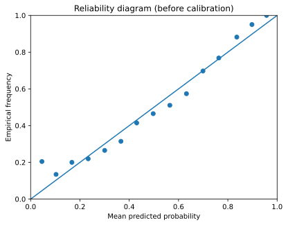

---

### Cell 36 — Calibration Questions (Markdown)

Asks two questions:
1. Is the model overconfident, underconfident, or calibrated?
2. Which of NLL, Brier, and ECE is most directly a calibration metric?

### Cell 37 — Calibration Answers (Markdown)

**Answer 1:** Logistic regression is generally close to calibrated (it optimizes log-likelihood, a proper scoring rule). Points slightly above the diagonal indicate slight **underconfidence**.

**Answer 2:** **ECE** is the most direct calibration metric because it *only* measures the gap between predicted confidence and observed accuracy. NLL and Brier combine calibration with **refinement** (how well the model separates classes) — they reward both being right and being confident, not just being calibrated.

> **Deep Dive — Why Logistic Regression Tends to Be Well-Calibrated**
>
> Logistic regression optimizes the **log-likelihood** (cross-entropy loss):
>
> $$\mathcal{L} = -\sum_{i=1}^N \left[y_i \log p_i + (1 - y_i) \log(1 - p_i)\right]$$
>
> This is a **proper scoring rule**, meaning it is minimized when $p_i$ equals the true conditional probability $P(Y = 1 | x_i)$. At the optimum, the first-order conditions ensure that predicted and observed frequencies align *on average within each region of the feature space*. This is why logistic regression is approximately calibrated "out of the box" — unlike models like SVMs or random forests, which optimize objectives that don't directly correspond to probabilities.

---

### Cell 38 — Temperature Scaling Instructions (Markdown)

Describes the procedure:
1. Split training data into a smaller training set and a **calibration set**.
2. Fit the model on the smaller training set.
3. Use the calibration set to find the best temperature $T$ (the one that minimizes NLL on the calibration set).
4. Compare metrics before and after scaling on the test set.

### Cell 39 — Temperature Scaling Code (Code)

```python
X_tr, X_cal, y_tr, y_cal = train_test_split(
    X_train, y_train, test_size=0.3, random_state=1, stratify=y_train)
```

1. Split the training data again: 70% for training the model, 30% for calibrating the temperature. This gives us:
   - `X_tr, y_tr`: Training set (≈3920 samples)
   - `X_cal, y_cal`: Calibration set (≈1680 samples)
   - `X_test, y_test`: Test set (2400 samples — untouched)

```python
clf2 = Pipeline([
    ('scaler', StandardScaler()),
    ('lr', LogisticRegression(max_iter=1000))
])
clf2.fit(X_tr, y_tr)
```

2. Train a new logistic regression model on the smaller training set.

```python
logits_cal = clf2.named_steps['lr'].decision_function(
    clf2.named_steps['scaler'].transform(X_cal))
logits_test = clf2.named_steps['lr'].decision_function(
    clf2.named_steps['scaler'].transform(X_test))
```

3. Extract **logits** (raw scores before sigmoid) for the calibration and test sets.
   - `named_steps['scaler']` accesses the scaler inside the pipeline.
   - `named_steps['lr'].decision_function(...)` gets the raw logit $z$ (not the probability $\sigma(z)$).

```python
Ts = np.logspace(-2, 2, 80)
cal_nll = []
for T in Ts:
    p = temperature_scale(logits_cal, T)
    cal_nll.append(log_loss(y_cal, p))
cal_nll = np.array(cal_nll)

best_T = Ts[np.argmin(cal_nll)]
```

4. **Grid search** over 80 temperature values from 0.01 to 100 (logarithmically spaced).
5. For each $T$, apply temperature scaling to calibration logits and compute the NLL.
6. Pick the $T$ with the lowest calibration NLL.

```python
plt.figure()
plt.plot(Ts, cal_nll)
plt.xscale('log')
```

7. Plot the NLL-vs-temperature curve. The minimum shows the optimal $T$.

```python
p_before = 1 / (1 + np.exp(-logits_test))
p_after = temperature_scale(logits_test, best_T)
```

8. Compute probabilities before (standard sigmoid) and after (temperature-scaled sigmoid) on the test set.

```python
print('Before: NLL', ..., 'Brier', ..., 'ECE', ...)
print('After : NLL', ..., 'Brier', ..., 'ECE', ...)
```

9. Compare all three metrics before and after scaling.

```python
reliability_diagram(p_before, y_test, n_bins=15, title='Reliability diagram (before temp scaling)')
reliability_diagram(p_after, y_test, n_bins=15, title='Reliability diagram (after temp scaling)')
```

10. Visual comparison: after scaling, points should be closer to the diagonal.

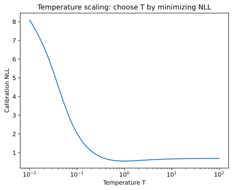

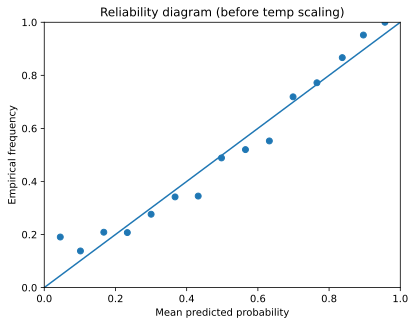

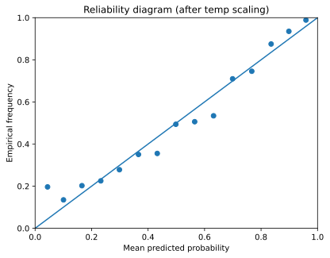

**Result:** The best $T \approx 0.94$ (close to 1), suggesting the model was already nearly calibrated. Small improvements in ECE and Brier are expected. NLL may improve slightly or stay the same.

---

### Cell 40 — Temperature Scaling Discussion (Markdown)

Key takeaways:
- Temperature scaling is a **monotonic transformation** — it doesn't change the *ranking* of predictions (AUC stays the same), only the *confidence levels*.
- ECE should improve (that's the goal).
- NLL should improve (that's what we optimized).
- Brier may improve slightly (it partially measures calibration).
- The fact that one scalar $T$ can fix calibration suggests the miscalibration was systematic (uniformly over- or underconfident).

> **Deep Dive — Proper Scoring Rules**
>
> A **scoring rule** $S(p, y)$ measures the quality of a predicted probability $p$ given outcome $y$. A scoring rule is **proper** if the expected score is optimized when the predicted probabilities equal the true probabilities:
>
> $$\mathbb{E}_{y \sim p^*}[S(p, y)] \text{ is minimized (for losses) when } p = p^*$$
>
> Key proper scoring rules and their formulas:
>
> | Rule | Formula | Measures |
> |------|---------|----------|
> | **Log loss (NLL)** | $-[y \log p + (1-y)\log(1-p)]$ | Calibration + sharpness |
> | **Brier score** | $(p - y)^2$ | Calibration + discrimination |
>
> ECE is *not* a proper scoring rule — you can game ECE by predicting the marginal class frequency for every input (perfectly calibrated but useless). This is why NLL and Brier are preferred for model training, while ECE is useful only for *diagnosing* calibration.
>
> The **Brier score decomposition** reveals its components:
>
> $$\text{Brier} = \underbrace{\frac{1}{N}\sum_b n_b(\bar{p}_b - \bar{y}_b)^2}_{\text{Calibration (REL)}} - \underbrace{\frac{1}{N}\sum_b n_b(\bar{y}_b - \bar{y})^2}_{\text{Resolution (RES)}} +\underbrace{\bar{y}(1-\bar{y})}_{\text{Uncertainty (UNC)}}$$
>
> - **Calibration (REL)**: Same as ECE squared — measures miscalibration. Lower is better.
> - **Resolution (RES)**: How much the model's predictions vary across bins. Higher is better (subtracted).
> - **Uncertainty (UNC)**: Inherent unpredictability of the outcomes. Fixed for a given dataset.

---

### Cell 41 — PPC Introduction (Markdown)

Introduces **Posterior Predictive Checks (PPCs)** for regression. The idea:

1. Fit a model and estimate its noise level $\sigma$.
2. The predictive distribution is: $Y | x \sim \mathcal{N}(f(x), \sigma^2)$.
3. Generate "fake" data from this distribution and compare it to real data.
4. If the fake data looks like the real data, the model is a good fit.

> **Analogy:** If someone claims they can forge your signature, you'd compare their forgeries to your real signature. If you can't tell the difference, they're good. PPCs do this for models: "Can the model generate data that looks like the real thing?"

### Cell 42 — Regression Data Setup (Code)

```python
Xr, yr = make_regression(n_samples=4000, n_features=10, noise=15.0, random_state=0)
Xr_train, Xr_test, yr_train, yr_test = train_test_split(Xr, yr, test_size=0.3, random_state=0)
```

1. Generate a synthetic regression dataset: 4000 samples, 10 features, noise level 15.

```python
reg = Pipeline([
    ('scaler', StandardScaler()),
    ('ridge', Ridge(alpha=1.0))
])
reg.fit(Xr_train, yr_train)
```

2. Fit a Ridge regression pipeline (standard scaler + Ridge with $\alpha = 1$).

```python
mu_train = reg.predict(Xr_train)
mu_test = reg.predict(Xr_test)
```

3. Get predictions for train and test sets.

```python
resid = yr_train - mu_train
sigma_hat = np.std(resid)
print('Estimated sigma:', sigma_hat)
```

4. Estimate the noise standard deviation from training residuals:
   - **Residuals** = actual values minus predictions.
   - $\hat{\sigma}$ = standard deviation of residuals ≈ 14.73.
   - This estimates how noisy the data is *beyond* what the model can explain.

---

### Cell 43 — NLL Instructions (Markdown)

Asks to implement the average Gaussian negative log-likelihood:

$$\text{NLL} = -\frac{1}{n} \sum_{i=1}^n \log \mathcal{N}(y_i | \mu_i, \sigma^2)$$

### Cell 44 — NLL Implementation (Code)

```python
import math

def gaussian_nll(y, mu, sigma):
    """Average negative log-likelihood for a Gaussian predictive distribution N(mu, sigma^2)."""
    y = np.asarray(y)
    mu = np.asarray(mu)
    nll = 0.5 * np.log(2 * math.pi * sigma**2) + 0.5 * ((y - mu)**2) / (sigma**2)
    return float(np.mean(nll))
```

Line-by-line of the NLL formula:

The log-pdf of a Gaussian is:

$$\log \mathcal{N}(y | \mu, \sigma^2) = -\frac{1}{2} \log(2\pi\sigma^2) - \frac{(y - \mu)^2}{2\sigma^2}$$

The **negative** log-likelihood flips the sign:

$$\text{NLL}_i = \frac{1}{2} \log(2\pi\sigma^2) + \frac{(y_i - \mu_i)^2}{2\sigma^2}$$

1. **`0.5 * np.log(2 * math.pi * sigma**2)`** — The constant term. It depends only on $\sigma$, not on how good the prediction is. Think of it as the "base cost" of the noise level.

2. **`0.5 * ((y - mu)**2) / (sigma**2)`** — The "surprise" term. Large when the prediction $\mu$ is far from the truth $y$. Divided by $\sigma^2$ because: if noise is high, large errors are expected and less "surprising."

3. **`np.mean(nll)`** — Average across all data points.

```python
print('Test NLL:', gaussian_nll(yr_test, mu_test, sigma_hat))
```

4. Result: ≈ 4.10. This is the average "surprise" per test point.

---

### Cell 45 — PPC Instructions (Markdown)

Asks to:
1. Simulate 500 "replicated" datasets from the model.
2. Compute two statistics on each: $T_1 = \text{mean}(y)$ and $T_2 = \text{var}(y)$.
3. Compare the distribution of replicated statistics to the observed statistics.

### Cell 46 — PPC Code (Code)

```python
np.random.seed(42)
S = 500
T1_rep = []
T2_rep = []
```

1. Setup: 500 replications.

```python
for s in range(S):
    y_rep = np.random.normal(mu_test, sigma_hat)
    T1_rep.append(np.mean(y_rep))
    T2_rep.append(np.var(y_rep))
```

2. For each replication:
   - Generate fake test outcomes: $\tilde{y}_i \sim \mathcal{N}(\hat{\mu}_i, \hat{\sigma}^2)$ for each test point $i$.
   - Compute the mean and variance of these fake outcomes.

```python
T1_obs = np.mean(yr_test)
T2_obs = np.var(yr_test)
```

3. Compute the same statistics on the *real* test outcomes.

```python
fig, axes = plt.subplots(1, 2, figsize=(12, 4))

axes[0].hist(T1_rep, bins=30, alpha=0.7, color='steelblue', edgecolor='white')
axes[0].axvline(T1_obs, color='red', linestyle='--', linewidth=2, label=f'Observed = {T1_obs:.2f}')
```

4. Plot histograms of the replicated statistics with the observed value as a red dashed line.

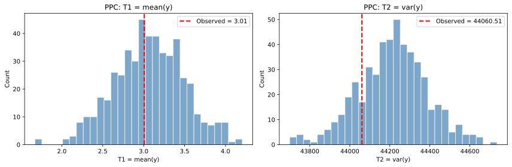

**How to interpret:**
- If the red line falls **within** the histogram: the model can generate data with similar properties → good fit for that statistic.
- If the red line falls **far outside** the histogram: the model fails to reproduce that aspect of the data → model misspecification.

The output shows:
- **$T_1$ (mean):** Observed mean (≈3.0) falls within the replicated distribution → the model captures the central tendency.
- **$T_2$ (variance):** Observed variance (≈44,060) falls within the replicated distribution → the model's noise estimate $\hat{\sigma}$ is reasonable.

---

### Cell 47 — PPC Discussion (Markdown)

Summarizes the interpretation:
- If $T_1$ matches → model gets the average right.
- If $T_2$ matches → model gets the spread right.
- If either fails → the model is missing something (wrong mean function, wrong noise model, etc.).

PPCs are powerful because they test specific, interpretable aspects of model fit without needing to know the true data-generating process.

> **Deep Dive — The Bayesian p-value**
>
> A PPC can be quantified using the **posterior predictive p-value**:
>
> $$p_B = P(T(\tilde{y}) \geq T(y_{\text{obs}}) \mid \text{Model})$$
>
> This is the fraction of replicated datasets whose test statistic exceeds the observed statistic. In the histograms above, it equals the fraction of the histogram to the right of the red line. Values near 0 or 1 indicate model misfit (the model systematically over- or under-produces that statistic). Values near 0.5 indicate good fit.
>
> **Caution:** Bayesian p-values are *not* the same as frequentist p-values. They tend to be conservative (biased toward 0.5) because the model was fit on the same data used to compute the statistic.

> **Deep Dive — What Other Test Statistics Could You Use?**
>
> $T_1 = \text{mean}(y)$ and $T_2 = \text{var}(y)$ check the first two moments, but you could also check:
> - **Skewness** $T_3 = \frac{1}{n}\sum\left(\frac{y_i - \bar{y}}{\hat{\sigma}}\right)^3$ — does the model capture asymmetry?
> - **Max residual** $T_4 = \max_i |y_i - \hat{\mu}_i|$ — does the model account for outliers?
> - **Autocorrelation** (if data is ordered) — does the model miss sequential patterns?
>
> The choice of test statistic should be guided by what aspects of the data matter for your application.

---

### Check Your Understanding — Part III

<details>
<summary><strong>Q1:</strong> A model predicts 80% probability for 100 patients. 60 of them actually have the condition. Is the model overconfident or underconfident? What is the ECE contribution from this bin?</summary>

The model is **overconfident** — it said 80% but the true rate is only 60%.

ECE contribution from this bin:

$$\frac{n_b}{N} \cdot |\text{acc}(b) - \text{conf}(b)| = \frac{100}{N} \cdot |0.60 - 0.80| = \frac{100}{N} \cdot 0.20$$

If the full dataset has $N = 1000$, this bin contributes $0.1 \times 0.20 = 0.02$ to the total ECE.
</details>

<details>
<summary><strong>Q2:</strong> Temperature scaling with $T = 2$ is applied to a logit of $z = 1.0$. What is the probability before and after scaling?</summary>

**Before** ($T = 1$):

$$p = \sigma(1.0) = \frac{1}{1 + e^{-1.0}} = \frac{1}{1 + 0.368} \approx 0.731$$

**After** ($T = 2$):

$$p = \sigma(1.0 / 2) = \sigma(0.5) = \frac{1}{1 + e^{-0.5}} = \frac{1}{1 + 0.607} \approx 0.622$$

The probability moved from 0.731 toward 0.5 — the model became less confident, which is what $T > 1$ ("cooling") does.
</details>

<details>
<summary><strong>Q3:</strong> In a PPC, the observed variance falls far to the right of the replicated distribution. What does this tell you about the model?</summary>

The model **underestimates the variance** of the data. Its assumed noise level $\hat{\sigma}$ is too small — the real data is more spread out than the model thinks. This means the model's prediction intervals would be **too narrow** (overconfident). You might need to:
- Use a more flexible model that captures patterns the current model misses.
- Use a heteroscedastic noise model (where $\sigma$ depends on $x$).
- Simply increase $\hat{\sigma}$.
</details>

---

## 5. Part IV: Conformal Prediction (Cells 48–54)

### Cell 48 — Part IV Introduction (Markdown)

Introduces **conformal prediction** — a method that produces prediction intervals with **guaranteed coverage**, regardless of the model's correctness.

The **split conformal** algorithm:

1. Fit a model on the training set.
2. On a separate **calibration set**, compute residuals: $r_i = |y_i - \hat{y}_i|$.
3. Find $q$, the $(1-\alpha)$-quantile of $\{r_i\}$.
4. For a new input $x$: predict $[\hat{y}(x) - q, \; \hat{y}(x) + q]$.

This interval has a mathematical guarantee: if the calibration and test data are **exchangeable** (roughly: drawn from the same distribution), the interval covers the true value with probability $\geq 1 - \alpha$.

> **Deep Dive — The Conformal Coverage Theorem**
>
> **Theorem (Vovk et al., 2005):** Let $(X_1, Y_1), \ldots, (X_n, Y_n), (X_{n+1}, Y_{n+1})$ be exchangeable random variables. Define the conformity score $r_i = |Y_i - \hat{Y}_i|$ for a model $\hat{Y}$ trained on the first $n$ points. Then:
>
> $$P\left(Y_{n+1} \in [\hat{Y}_{n+1} - q, \; \hat{Y}_{n+1} + q]\right) \geq 1 - \alpha$$
>
> where $q = \text{Quantile}_{(1-\alpha)}(r_1, \ldots, r_n, \infty)$, i.e., the $(1-\alpha)$-quantile of the calibration residuals augmented with $+\infty$.
>
> **Why it works (intuition):** Under exchangeability, the test residual $r_{n+1}$ is equally likely to be in any rank position among $\{r_1, \ldots, r_n, r_{n+1}\}$. So $P(r_{n+1} \leq q) \geq \frac{\lceil(1-\alpha)(n+1)\rceil}{n+1} \geq 1 - \alpha$.
>
> **What's remarkable:** This guarantee holds for *any* model (linear, neural network, random forest) and *any* data distribution — as long as exchangeability holds. The model doesn't need to be "correct."

> **Analogy:** Imagine you're estimating how long your commute takes. You record your commute times for a month (calibration). The 90th percentile of your recorded times becomes your safety margin. You can then say: "My commute will almost certainly be within this margin" — and you'll be right at least 90% of the time.

### Cell 49 — Conformal Implementation (Code)

```python
Xr_tr, Xr_temp, yr_tr, yr_temp = train_test_split(Xr, yr, test_size=0.4, random_state=0)
Xr_cal, Xr_te, yr_cal, yr_te = train_test_split(Xr_temp, yr_temp, test_size=0.5, random_state=0)
```

1. Split data three ways:
   - **Training**: 60% — used to fit the model.
   - **Calibration**: 20% — used to compute the quantile.
   - **Test**: 20% — used to evaluate coverage.

```python
base = Pipeline([
    ('scaler', StandardScaler()),
    ('ridge', Ridge(alpha=1.0))
])
base.fit(Xr_tr, yr_tr)
```

2. Fit Ridge regression on the training set only.

```python
pred_cal = base.predict(Xr_cal)
pred_te = base.predict(Xr_te)
```

3. Get predictions for calibration and test sets.

```python
resid_cal = np.abs(yr_cal - pred_cal)
```

4. Compute **absolute residuals** on the calibration set: $r_i = |y_i - \hat{y}_i|$. These measure how wrong the model is on each calibration point.

```python
def split_conformal_interval(pred, resid_cal, alpha=0.1):
    """Split conformal prediction interval."""
    n = len(resid_cal)
    q_level = np.ceil((1 - alpha) * (n + 1)) / n
    q = np.quantile(resid_cal, min(q_level, 1.0))
    lower = pred - q
    upper = pred + q
    return lower, upper
```

5. **`n = len(resid_cal)`** — Number of calibration points.

6. **`q_level = np.ceil((1 - alpha) * (n + 1)) / n`** — This is the **finite-sample correction**. Instead of just taking the $(1-\alpha)$ quantile, we use $\lceil (1-\alpha)(n+1) \rceil / n$, which is slightly larger. This correction is what gives conformal prediction its *finite-sample* coverage guarantee (it works for any $n$, not just asymptotically).

   For example, with $\alpha = 0.1$ and $n = 800$:
   $$q_{\text{level}} = \frac{\lceil 0.9 \times 801 \rceil}{800} = \frac{721}{800} = 0.90125$$

7. **`q = np.quantile(resid_cal, min(q_level, 1.0))`** — Find the quantile of the calibration residuals at this level. The `min(..., 1.0)` caps at 1.0 (you can't take a quantile above 100%).

8. **`lower = pred - q`** and **`upper = pred + q`** — The prediction interval is symmetric around the point prediction, with half-width $q$.

```python
L, U = split_conformal_interval(pred_te, resid_cal, alpha=0.1)
coverage = np.mean((yr_te >= L) & (yr_te <= U))
avg_width = np.mean(U - L)
print('Empirical coverage:', coverage)
print('Average interval width:', avg_width)
```

9. Check how many test points actually fall inside the interval (**empirical coverage**). With $\alpha = 0.1$, we expect coverage $\geq 0.90$.
10. Compute the average width of the interval — a measure of how informative (narrow) the intervals are.

**Result:** Coverage ≈ 0.899 (close to the target 0.90), width ≈ 47.

---

### Cell 50 — Coverage-Width Instructions (Markdown)

Asks to compute coverage and width for $\alpha \in \{0.05, 0.1, 0.2\}$ and discuss the tradeoff.

### Cell 51 — Coverage-Width Code (Code)

```python
for alpha_val in [0.05, 0.1, 0.2]:
    L, U = split_conformal_interval(pred_te, resid_cal, alpha=alpha_val)
    coverage = np.mean((yr_te >= L) & (yr_te <= U))
    avg_width = np.mean(U - L)
    print(f'alpha={alpha_val:.2f}: target coverage={1-alpha_val:.2f}, '
          f'empirical coverage={coverage:.4f}, avg interval width={avg_width:.2f}')
```

1. Loop over three $\alpha$ values and compute coverage and width for each.

**Results:**

| $\alpha$ | Target Coverage | Empirical Coverage | Average Width |
|----------|----------------|--------------------|---------------|
| 0.05     | 0.95           | 0.9575             | 57.39         |
| 0.10     | 0.90           | 0.8988             | 47.03         |
| 0.20     | 0.80           | 0.8100             | 37.85         |

Key observation: Lower $\alpha$ (higher target coverage) → wider intervals. You can't have both high coverage and narrow intervals — this is a fundamental tradeoff.

> **Deep Dive — Why the Tradeoff is Mathematically Inevitable**
>
> The interval width is $2q$ where $q$ is the $(1-\alpha)$-quantile of calibration residuals. As $\alpha$ decreases (demanding higher coverage), we move further into the tail of the residual distribution:
>
> $$\alpha_1 < \alpha_2 \implies (1 - \alpha_1) > (1 - \alpha_2) \implies q_{\alpha_1} \geq q_{\alpha_2}$$
>
> This is a direct consequence of quantile monotonicity. The only way to make intervals narrower *without* sacrificing coverage is to improve the underlying model (reduce residuals). Conformal prediction reveals the model's true uncertainty — it cannot create information that isn't there.

---

### Cell 52 — Coverage-Width Discussion (Markdown)

Explains the **coverage-width tradeoff**:

- **Smaller $\alpha$ (e.g., 0.05)**: Wider intervals but stronger guarantee. Better for safety-critical applications where missing the true value is costly.
- **Larger $\alpha$ (e.g., 0.20)**: Narrower, more informative intervals but weaker guarantee. Better when a rough range is sufficient.

> **Analogy:** It's like choosing between "The patient's blood pressure is between 110 and 150" (high coverage, wide interval) and "between 125 and 135" (low coverage, narrow interval). The first is almost certainly right but not very helpful; the second is helpful but might be wrong.

---

### Cell 53 — Exchangeability & Weighted Conformal Instructions (Markdown)

Asks about:
1. What assumptions does conformal prediction need?
2. Why does covariate shift break these assumptions?
3. What are weighted conformal methods?

### Cell 54 — Exchangeability & Weighted Conformal Answer (Markdown)

**Exchangeability assumption:** Split conformal requires that the calibration and test data are **exchangeable** — informally, that they "come from the same world." Mathematically, if you shuffled calibration and test residuals together, you couldn't tell which were which. i.i.d. (independent and identically distributed) data is always exchangeable, but exchangeability is a weaker condition.

**Why covariate shift breaks this:** Under covariate shift, test inputs come from a different distribution than calibration inputs. The model may make systematically different (usually larger) errors on the shifted test data. The calibration residuals no longer represent what errors to expect at test time, so the quantile $q$ may be too small → the intervals don't cover enough test points.

**Weighted conformal methods:** The fix is to **reweight** calibration residuals using **likelihood ratios** (also called **importance weights**):

$$w_i = \frac{p_{\text{test}}(x_i)}{p_{\text{cal}}(x_i)}$$

- Calibration points that look like test points (high $w_i$) get more influence on the quantile.
- Calibration points that look unlike test points (low $w_i$) get less influence.
- This adjusts the quantile to reflect the test distribution, restoring coverage guarantees under shift.

> **Analogy:** Imagine you calibrated your commute estimate using data from summer months, but now it's winter and roads are icy. You'd want to give more weight to the few snowy days in your calibration data and less weight to sunny days. That's what weighted conformal does.

> **Deep Dive — The Weighted Conformal Quantile Formula**
>
> In standard conformal, we compute the unweighted quantile of residuals. In weighted conformal, the quantile becomes a *weighted* quantile. Define the weighted empirical CDF:
>
> $$\hat{F}_w(t) = \frac{\sum_{i=1}^n w_i \cdot \mathbf{1}[r_i \leq t]}{\sum_{i=1}^n w_i}$$
>
> where $w_i = p_{\text{test}}(x_i) / p_{\text{cal}}(x_i)$ are the importance weights. The conformal quantile $q$ is then:
>
> $$q = \inf\left\{t : \hat{F}_w(t) \geq 1 - \alpha\right\}$$
>
> This reweighting ensures calibration points that "look like" the test distribution dominate the quantile calculation. The theoretical guarantee becomes:
>
> $$P\left(y_{n+1} \in [\hat{y}_{n+1} - q, \; \hat{y}_{n+1} + q]\right) \geq 1 - \alpha$$
>
> provided the weights are correctly specified. In practice, weights must be estimated (e.g., by training a classifier to distinguish calibration from test inputs), introducing some approximation error.

> **Deep Dive — Exchangeability vs. i.i.d.**
>
> A sequence of random variables $Z_1, Z_2, \ldots, Z_n$ is **exchangeable** if their joint distribution is invariant to permutation:
>
> $$p(Z_1, Z_2, \ldots, Z_n) = p(Z_{\pi(1)}, Z_{\pi(2)}, \ldots, Z_{\pi(n)})$$
> $$\text{for all permutations } \pi$$
> Every i.i.d. sequence is exchangeable, but exchangeability is weaker — it allows dependence, as long as the dependence is "symmetric." For example, draws without replacement from a finite population are exchangeable but not independent. Conformal prediction only needs exchangeability, making it applicable in slightly more settings than methods that require full independence.

---

### Check Your Understanding — Part IV

<details>
<summary><strong>Q1:</strong> Why does split conformal produce intervals of constant width $2q$ regardless of the input $x$? Is this a strength or a weakness?</summary>

Because the quantile $q$ is a single number computed from all calibration residuals — it doesn't depend on $x$. This is both:
- A **strength**: the method is extremely simple and makes no distributional assumptions.
- A **weakness**: the intervals don't adapt to local difficulty. In regions where the model is very accurate, the intervals are unnecessarily wide; in regions where the model is poor, they may be too narrow. Methods like **conformalized quantile regression** address this by producing intervals that vary with $x$.
</details>

<details>
<summary><strong>Q2:</strong> If you have $n = 100$ calibration points and want 90% coverage ($\alpha = 0.1$), what quantile level does the finite-sample correction give?</summary>

$$q_{\text{level}} = \frac{\lceil (1 - 0.1)(100 + 1) \rceil}{100} = \frac{\lceil 90.9 \rceil}{100} = \frac{91}{100} = 0.91$$

So we take the 91st percentile of the calibration residuals, slightly higher than the naive 90th percentile. This correction ensures the coverage guarantee holds in finite samples, not just asymptotically.
</details>

<details>
<summary><strong>Q3:</strong> Under covariate shift, could the empirical coverage of split conformal be *higher* than the target? Or only lower?</summary>

Both are possible. If the model happens to be *more* accurate in the shifted test region than in the calibration region, the calibration residuals overestimate test errors, making the intervals wider than needed — so coverage exceeds the target. But the more dangerous case is the opposite: if the model is *less* accurate on shifted data, coverage drops below the target. Without the exchangeability assumption, there is simply no guarantee in either direction.
</details>

---

## Summary of Key Concepts

| Concept | Plain-English Definition |
|---------|------------------------|
| **MLE** | Find the single "best" set of parameters that makes the data most probable |
| **Overfitting** | Model memorizes training noise; performs poorly on new data |
| **Underfitting** | Model is too simple to capture the true pattern |
| **Covariate shift** | Test data comes from a different distribution than training data |
| **Bootstrap** | Resample training data with replacement to estimate uncertainty |
| **Bayesian inference** | Maintain a distribution over parameters, updated by data |
| **Prior** | Your beliefs before seeing data |
| **Posterior** | Your beliefs after seeing data |
| **Epistemic uncertainty** | Uncertainty from limited data (reducible with more data) |
| **Aleatoric uncertainty** | Uncertainty from inherent noise (irreducible) |
| **Calibration** | Predicted probabilities match observed frequencies |
| **ECE** | Single number measuring calibration quality |
| **Temperature scaling** | Post-hoc adjustment to improve calibration |
| **PPC** | Generate fake data from the model; compare to real data |
| **Conformal prediction** | Distribution-free prediction intervals with coverage guarantees |
| **Exchangeability** | Data points are statistically interchangeable (no ordering matters) |

---

## Check Your Understanding — Full Homework Review

These questions span the entire homework. Try to answer each one before revealing the answer.

<!-- <details> -->
<summary><strong>Q1:</strong> What is the single most important theme of this entire homework?</summary>

Managing model risk under **covariate shift**. Every part explores a different angle:
- Part I shows that MLE models and bootstrap uncertainty *fail* under shift.
- Part II shows that Bayesian models *succeed* at flagging uncertain regions.
- Part III shows how to *measure* whether uncertainty is trustworthy (calibration).
- Part IV shows how to *guarantee* coverage even without knowing the model is correct (conformal prediction).

The unifying lesson: standard ML practices (CV, regularization, MLE) optimize for in-distribution performance but can produce dangerously overconfident predictions under shift.
<!-- </details> -->

<!-- <details> -->
<summary><strong>Q2:</strong> Rank the following methods from "least useful under covariate shift" to "most useful": (a) Bootstrap MLE, (b) Bayesian posterior predictive, (c) Split conformal, (d) Weighted conformal.</summary>

**Least useful → Most useful under covariate shift:**

1. **(a) Bootstrap MLE** — uncertainty collapses with more data everywhere, no shift awareness
2. **(c) Split conformal** — guarantees coverage under exchangeability, but exchangeability breaks under shift
3. **(b) Bayesian posterior predictive** — naturally widens in data-poor regions, but coverage depends on model correctness
4. **(d) Weighted conformal** — explicitly corrects for shift via importance weights, restoring coverage guarantees

Note: (b) and (c) could be swapped depending on whether the model is well-specified. Bayesian is better if the model is correct; conformal is better if you don't trust the model but data is exchangeable.
<!-- </details> -->

<!-- <details> -->
<summary><strong>Q3:</strong> Write the mathematical connection between Ridge regression and the Bayesian posterior mean. Why is this connection important?</summary>

The Ridge solution is:

$$\hat{\mathbf{w}}_{\text{Ridge}} = \left(\Phi^\top \Phi + \alpha I\right)^{-1} \Phi^\top \mathbf{y}$$

The Bayesian posterior mean (with prior variance $\alpha_{\text{prior}}$ and noise $\sigma^2$) is:

$$\mu_N = \left(\frac{1}{\alpha_{\text{prior}}} I + \frac{1}{\sigma^2} \Phi^\top \Phi\right)^{-1} \frac{1}{\sigma^2} \Phi^\top \mathbf{y}$$

Setting $\alpha_{\text{Ridge}} = \sigma^2 / \alpha_{\text{prior}}$ makes these identical. This means:
- Ridge regression is the **MAP estimate** (maximum a posteriori) of Bayesian linear regression with a Gaussian prior.
- But Ridge only gives you the *point estimate*, not the full posterior. The Bayesian approach gives you the entire distribution — and therefore uncertainty.
<!-- </details> -->

---

*Generated as a study companion for ELEC70122 Homework 1.*
